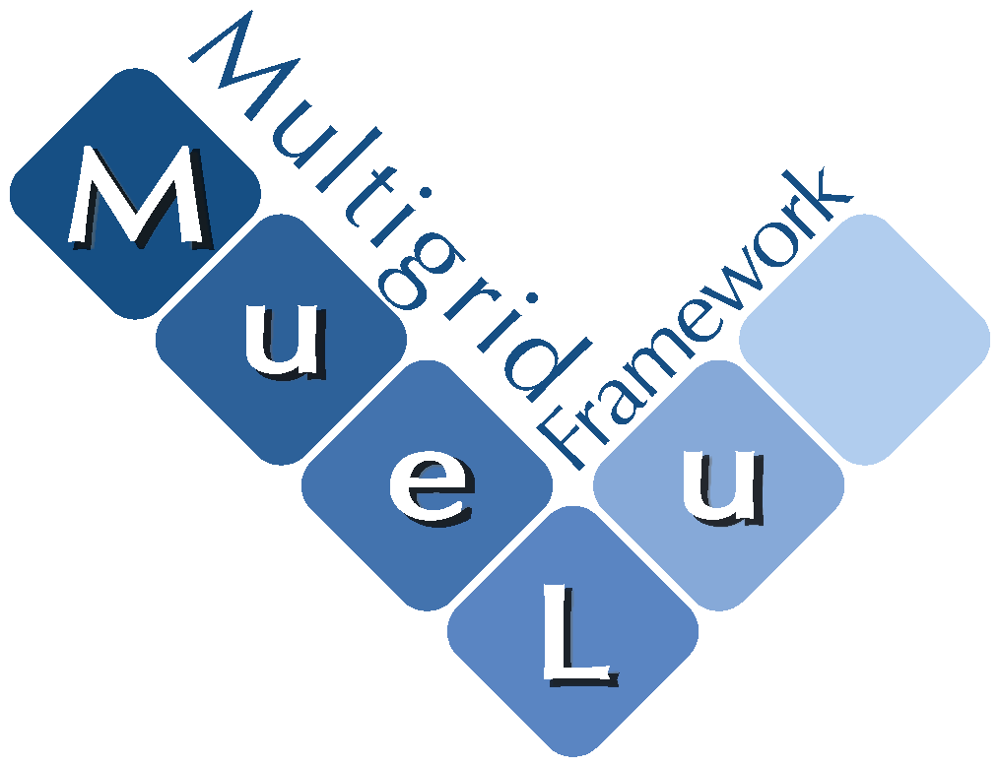

# MueLu: A package for multigrid based preconditioning





MueLu is designed to solve large sparse linear systems of equations arising from PDE discretizations. MueLu provides easy-to-use multigrid solvers and preconditioners based on smoothed aggregation algorithms. As a multigrid framework, MueLu supports the design of highly application specific multigrid preconditioners.

## Overview

MueLu is a flexible, high-performance multigrid solver library. It provides a variety of multigrid algorithms for these problem classes:

*   Poisson
*   Elasticity
*   convection-diffusion
*   Maxwell’s equations (eddy current formulation)

MueLu is extensible and allows for the research and development of new multigrid preconditioning methods.

## Features

*   **Runs on modern CPUs and GPUs.**
*   **Easy-to-use interface:** MueLu has a user-friendly parameter input deck which covers most important use cases, with reasonable defaults provided for common problem types.
*   **Modern object-oriented software architecture:** MueLu is written completely in C++ as a modular object-oriented multigrid framework, which provides flexibility to combine and reuse existing components to develop novel multigrid methods.
*   **Extensibility:** Due to its flexible design, MueLu is an excellent toolkit for research on novel multigrid concepts. Experienced multigrid users have full access to the underlying framework through an advanced XML based interface. Expert users may use and extend the C++ API directly.
*   **Integration with Trilinos:** As a package of Trilinos, MueLu is well integrated into the Trilinos environment and depends on the Tpetra solver stack:
    * Belos (Krylov solvers)
    * Ifpack2( algebraic solvers)*
    * Amesos2 (sparse direct solvers)
    * Zoltan2 (load rebalancing).
    *   Tpetra sparse linear algebra: Belos (Krylov solvers), Ifpack2( algebraic solvers), Amesos2 (sparse direct solvers), Zoltan2 (load rebalancing).
*   **Broad range of supported platforms:** MueLu runs on wide variety of architectures, from desktop workstations to parallel Linux clusters and supercomputers.

## Citation

To cite MueLu, please use the following bibliography entries.

```bibtex
@techreport{MueLu,  
title={Mue{L}u User’s Guide},  
author={Luc Berger-Vergiat and Christian A. Glusa and Graham Harper and Jonathan J. Hu and Matthias Mayr and Peter Ohm and Andrey Prokopenko and Christopher M. Siefert and Raymond S. Tuminaro and Tobias A. Wiesner},
number={SAND2023-12265},
year={2023},
institution = {Sandia National Laboratories}
}```

```bibtex
@Misc{MueLuURL,  
author={MueLu development team},
title = {MueLu multigrid framework},
howpublished = {\url{http://trilinos.org/packages/muelu}},
year = {2026}
}
```

## Documentation

MueLu is part of the [Trilinos Project](https://trilinos.github.io), and additional information (e.g., examples, tutorials, and source code documentation) is available through [MueLu's Doxygen webpages](https://trilinos.github.io/docs/muelu/index.html), and [MueLu User’s Guide](https://trilinos.github.io/pdfs/mueluguide.pdf)

The [MueLu tutorial](https://muelu.github.io/) describes the most important features of MueLu, from beginning information to advanced usage. It contains accompanying exercises where the interested user can do their own experiments with multigrid parameters. The MueLu tutorial is part of the Trilinos repository, and its examples are automatically tested to ensure that they compile and run.

## Questions? 

Contact lead developers:

* **MueLu team**         (GitHub handle: @trilinos/muelu)

Bug reporting: [Issues](https://github.com/trilinos/Trilinos/issues) (preferred)

### Team

The current MueLu development team is

*   Luc Berger-Vergiat, Sandia National Labs
*   Max Firmbach, University of the Bundeswehr Munich
*   Christian Glusa, Sandia National Labs
*   Graham Harper, Sandia National Labs
*   Jonathan Hu, Sandia National Labs
*   Matthias Mayr, University of the Bundeswehr Munich
*   Malachi Phillips, Sandia National Labs
*   Chris Siefert, Sandia National Labs
*   Ray Tuminaro, Sandia National Labs

Contributors and former developers are

*   Tom Benson, LLNL
*   Emily Furst, University of Washington (summer intern, 2015)
*   Jeremie Gaidamour, INRIA
*   Axel Gerstenberger, Rolls Royce
*   Brian Kelley, Sandia National Labs
*   Andrey Prokopenko, ORNL
*   Paul Tsuji, LLNL
*   Peter Ohm, RIKEN Center for Computational Science
*   Jerry Watkins, Sandia National Labs
*   Tobias Wiesner, Leica


## Copyright and License

For general copyright and license information, refer to the Trilinos [License and Copyright](https://trilinos.github.io/about.html#license-and-copyright) page.

For MueLu-specific copyright and license details, refer to the [muelu/COPYRIGHT](COPYRIGHT) and [muelu/LICENSE](LICENSE) files located in the `muelu` directory. Additional copyright information may also be found in the headers of individual source files.

For developers, general guidance on documenting copyrights and licenses can be found in the Trilinos [Guidance on Copyrights and Licenses](https://github.com/trilinos/Trilinos/wiki/Guidance-on-Copyrights-and-Licenses) document.
