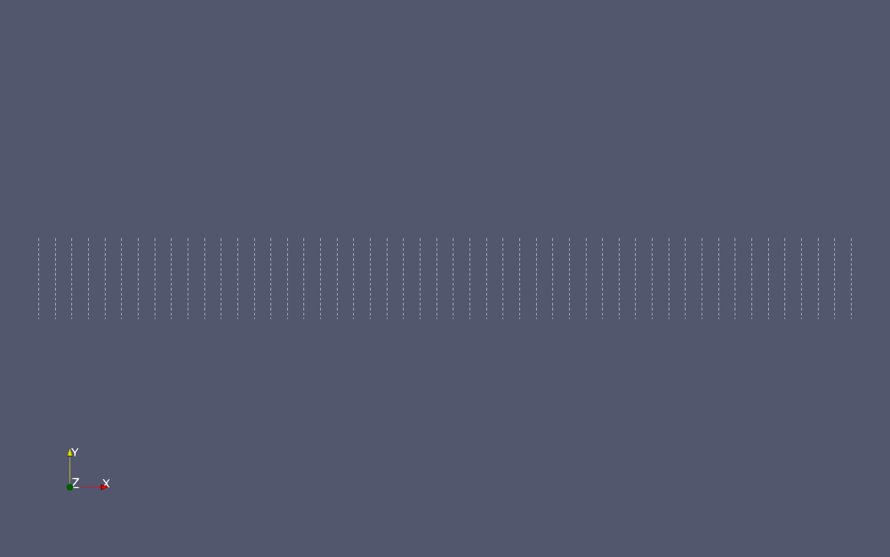

<!-- SAND2019-9193 PE -->

## At a Glance

|Questions|Objectives|Key Points|
|----|---|---|
|How do we choose a suitable Krylov solver?|Know when to use CG or GMRES.|CG works for spd matrix and preconditioner. GMRES works for unsymmetric systems, but requires more memory.|
|How do we choose a preconditioner?|Know common sparse preconditioners.|As the size of the linear system grows, most iterative methods will require increasing number of iterations.|
|How can we improve efficiency of the solver?|Understand the basic components of multigrid.|For certain common problem classes, multigrid methods require a constant number of iterations and constant work per unknown.|

#### Table of contents

  - [Set 1 - Krylov solver, no preconditioner](#set-1---krylov-solver-no-preconditioner)
  - [Set 2 - Krylov solver, simple preconditioners](#set-2---krylov-solver-simple-preconditioners)
  - [Set 3 - Krylov solver, multigrid preconditioner](#set-3---krylov-solver-multigrid-preconditioner)
  - [Set 4 - Krylov solver, multigrid preconditioner, considerations for CPU vs GPU](#set-4---krylov-solver-multigrid-preconditioner-considerations-for-cpu-vs-gpu)

#### To begin this lesson

Go to the directory for the example application in your Trilinos build directory
```
cd $TRILINOS_BUILD_DIR/packages/muelu/example/basic/
```

## The Problem Being Solved

The Poisson equation arises in electrostatics, incompressible fluid flow simulations, and numerous
other applications.  We will consider the Poisson equation

$$-\Delta u = f$$

on a square mesh of size $$n_x \times n_y$$ with Dirichlet boundary conditions $$u = 0$$.

It is discretized using central finite differences, leading to a symmetric positive definite (spd) matrix.

## The Example Source Code

For this lesson, we will be using the executable `MueLu_Stratimikos.exe` from the MueLu package of Trilinos which allows us to test a variety of solvers and preconditioners.

For the first part of the lesson, we will be running on a single MPI rank, so no need to ask for a massive allocation.

The executable takes several command line arguments that influence the linear system that is generated on the fly or read in from file.
A complete set of options will be printed by typing
```
./MueLu_Stratimikos.exe --help
```
The most important ones are:
```
Usage: ./MueLu_Stratimikos.exe [options]
  options:
  --help                               Prints this help message
  --nx                   int           mesh points in x-direction.
                                       (default: --nx=100)
  --ny                   int           mesh points in y-direction.
                                       (default: --ny=100)
  --nz                   int           mesh points in z-direction.
                                       (default: --nz=100)
  --matrixType           string        matrix type: Laplace1D, Laplace2D, Laplace3D, ...
                                       (default: --matrixType="Laplace2D")
  --xml                  string        read parameters from an xml file
                                       (default: --xml="stratimikos_ParameterList.xml")
  --yaml                 string        read parameters from a yaml file
                                       (default: --yaml="")
  --timings              bool          print timings to screen
  --notimings                          (default: --notimings)
```

Solvers (such as CG and GMRES) and preconditioners (such as Jacobi, Gauss-Seidel and multigrid) are configured via parameter files.

Trilinos supports both XML and YAML parameter files.

In order to make following along as simple as possible and avoid typos, parameter XML files for all examples can be found in the lesson folder.
If you want to see the difference between two input files, run ```diff set1-gmres.xml set1-cg.xml```.


## Running the Example

### Set 1 - Krylov solver, no preconditioner

The default Krylov method is GMRES, and no preconditioner is used.

:arrow_forward: Run
```
./MueLu_Stratimikos.exe --xml=set1-gmres.xml
```

#### Expected Behavior/Output

You should see output like this:

```
========================================================
Xpetra::Parameters
 Linear algebra library: Tpetra
Galeri::Xpetra::Parameters<int>
 Matrix type: Laplace2D
 Problem size: 10000 (100x100)
Processor subdomains in x direction: 1
Processor subdomains in y direction: 1
Processor subdomains in z direction: -1
========================================================
Galeri complete.
========================================================

  *******************************************************
  ***** Belos Iterative Solver:  Pseudo Block Gmres
  ***** Maximum Iterations: 100
  ***** Block Size: 1
  ***** Residual Test:
  *****   Test 1 : Belos::StatusTestImpResNorm<>: (2-Norm Res Vec) / (2-Norm Prec Res0), tol = 1e-08
  *******************************************************
  Iter   0, [ 1] :    1.000000e+00
  Iter  10, [ 1] :    3.043353e-03
  Iter  20, [ 1] :    4.505554e-04
  Iter  30, [ 1] :    1.474199e-04
  Iter  40, [ 1] :    6.753706e-05
  Iter  50, [ 1] :    4.149302e-05
  Iter  60, [ 1] :    2.096698e-05
  Iter  70, [ 1] :    1.172067e-05
  Iter  80, [ 1] :    7.528465e-06
  Iter  90, [ 1] :    5.958579e-06
  Iter 100, [ 1] :    4.273025e-06
  Passed.......OR Combination ->
    Failed.......Number of Iterations = 100 == 100
    Unconverged..(2-Norm Res Vec) / (2-Norm Prec Res0)
                 residual [ 0 ] = 4.27302e-06 > 1e-08
```

#### Examining Results

We observe the following:
- We constructed a 2D Laplace problem on a square mesh of 100 x 100 nodes, resulting in a linear system of 10000 unknowns.
- We have set two termination criteria for the solve: 100 iterations or a reduction of the residual norm by 8 orders of magnitude.
- The solve failed, since we reached 100 iterations, but only reduced the residual norm by a factor of 7e-06.

Now, modify the input file to use the conjugate gradient method.
We change the `Solver Type` parameter to `Pseudo Block CG`.

:arrow_forward: Run
```
./MueLu_Stratimikos.exe --xml=set1-cg.xml
```

:question: Do you see any significant changes in convergence behavior?

:left_speech_bubble: No, neither solver manages to converge in less than 100 iterations.

:question: Why is it preferable to use conjugate gradients over GMRES in this case?

:left_speech_bubble: CG has significantly lower memory requirements, since it uses a short recurrence. GMRES, on the other hand, has to keep the entire Krylov space around.

You can check the last answer by comparing the approximate memory usage of CG and GMRES using a Kokkos profiling tool.
(For this step to work, the [Kokkos Profiling tools](https://github.com/kokkos/kokkos-tools) need to be installed.)
```
export KOKKOS_TOOLS_LIBS=$KOKKOS_TOOLS_BUILD_DIR/profiling/memory-usage/libkp_memory_usage.so
./MueLu_Stratimikos.exe --nx=1000 --ny=1000 --xml=set1-gmres.xml
./MueLu_Stratimikos.exe --nx=1000 --ny=1000 --xml=set1-cg.xml
unset KOKKOS_TOOLS_LIBS
```
We used a larger problem to be able to see the difference more clearly.

In what follows, we will be using the CG solver.

---

### Set 2 - Krylov solver, simple preconditioners

We now explore some simple (and quite generic) options for preconditioning the problem.

So far, the `Preconditioner Type` parameter was set to `None`, meaning no preconditioning.
We now use `Ifpack2` instead.
Ifpack2 is another Trilinos package which provides a number of different simple preconditioners.

Moreover, we add the following configuration for Ifpack2.
```xml
<ParameterList name="Ifpack2">
  <Parameter name="Prec Type" type="string" value="relaxation"/>
  <ParameterList name="Ifpack2 Settings">
    <Parameter name="relaxation: type" type="string" value="Symmetric Gauss-Seidel"/>
    <Parameter name="relaxation: sweeps" type="int" value="1"/>
  </ParameterList>
</ParameterList>
```
This means that a single sweep of symmetric Gauss-Seidel is used for preconditioning.

:arrow_forward: Run
```
./MueLu_Stratimikos.exe --xml=set2-sgs1.xml
```

<!--  -->

<!-- Switch the `relaxation: type` from `Gauss-Seidel` to `Symmetric Gauss-Seidel`. -->
<!-- This corresponds to one forward and one backward sweep of Gauss-Seidel. -->

<!-- :arrow_forward: Rerun to verify that the solver is now converging. -->

We can strengthen the preconditioner by increasing the number of Gauss-Seidel sweeps we are using as a preconditioner.
We switch `relaxation: sweeps` to 3.

:arrow_forward: Run
```
./MueLu_Stratimikos.exe --xml=set2-sgs3.xml
```
and verify that the number of iterations further decreased.

Now, we will check whether we have created a scalable solver strategy.

:arrow_forward: Record the number of iterations for different problem sizes by running
```
./MueLu_Stratimikos.exe --xml=set2-sgs3.xml --nx=50  --ny=50
./MueLu_Stratimikos.exe --xml=set2-sgs3.xml --nx=100 --ny=100
./MueLu_Stratimikos.exe --xml=set2-sgs3.xml --nx=200 --ny=200
```
(This means that we are running the same 2D Laplace problem as above, but on meshes of size 50x50, etc.)

:question: Is the solver scalable?

:left_speech_bubble: No, the number of iterations increases with the problem size.

The number of iterations taken by CG scales with the square root of the condition number $$\kappa(PA)$$ of the preconditioned system, where $$P$$ is the preconditioner.

:question: Based on the iterations you recorded, how does this condition number roughly scale with respect to the number of unknowns?

:left_speech_bubble: In each step, the number of iterations grows by a factor of 2, and the number of unknowns grows by a factor of 4. Hence the condition number is proportional to the number of unknowns.

---

**Stop.** If you are following the lecture slides, please return to the slides before continuing to set 3.

---

### Set 3 - Krylov solver, multigrid preconditioner

The reason that the Gauss-Seidel preconditioner did not work well is that it effectively only reduces error locally, but not globally.
We hence need a global mechanism of error correction, which can be provided by adding one or more coarser grids.

We switch the `Preconditioner Type` parameter to `MueLu`, which is an algebraic multigrid package in Trilinos.

:arrow_forward: Run
```
./MueLu_Stratimikos.exe --xml=set3-mg-jacobi.xml --nx=50  --ny=50
./MueLu_Stratimikos.exe --xml=set3-mg-jacobi.xml --nx=100 --ny=100
./MueLu_Stratimikos.exe --xml=set3-mg-jacobi.xml --nx=200 --ny=200
```

:question: Is the solver scalable?

:left_speech_bubble: Yes, the number of iterations stays more or less constant as we increase the problem size.

<!-- The cost of a single mat-vec scales with the number of unknowns because the number of entries per row is bounded and small. -->
<!-- Since the number of iterations is constant, we (experimentally) have verified that multigrid has optimal complexity. -->
<!-- This means that any changes that we will make from here on can only lead to a constant factor improvement. -->

#### Understanding information about the multigrid preconditioner

Let's look a little more closely at the output from the largest example.

:arrow_forward: Rerun:
```
./MueLu_Stratimikos.exe --xml=set3-mg-jacobi.xml --nx=200 --ny=200
```
The multigrid summary provides the following information:

* The number of multigrid levels created, including the linear system of interest
* Operator complexity
* Smoother complexity
* The multigrid cycle type
* Matrix statistics for each level (rows, number of nonzeros, number of processors)
* The smoother used on each level

The operator complexity is given by the formula

$$\frac{\Sigma_0^L nnz(A_i)}{nnz(A_0)},$$

where $$A_0$$ is the fine level matrix.

:question: How does the operator complexity help the user assess potential performance?

:left_speech_bubble: The complexity gives the ratio of nonzeros in all matrices compared to the fine level matrix.  This is roughly the ratio of FLOPs required by
a matrix-vector product performed on each matrix relative to the fine level matrix.

The smoother complexity is the ratio of FLOPS required by smoothers on all levels to FLOPs required by just the fine level smoother.

:question: Why might the operator complexity and smoother complexity differ?'

:left_speech_bubble: A smoother such as an incomplete factorization will have a much higher FLOP intensity than a matrix-vector product.

#### Effect of different smoothers

The first adjustment that we want to make is to select different smoothers.
This involves the following trade-off: choosing a more effective smoother should reduce the number of iterations, but might involve more computation.

By default, we use a single sweep of Jacobi smoothing, which is very cheap.

:arrow_forward: First, we run
```
./MueLu_Stratimikos.exe --xml=set3-mg-jacobi.xml --timings --nx=1000 --ny=1000
```
to display timing information on a large enough problem.
The relevant timer to look at is `Belos: PseudoBlockCGSolMgr total solve time`.
(You might want to run this more than once in case you are experiencing some system noise.)
Since there are quite a lot of timers, you could grep for the iteration count and the timer by appending
```|  grep -E "total solve time|Number of Iterations"``` to the command, i.e.,
```
./MueLu_Stratimikos.exe --xml=set3-mg-jacobi.xml --timings --nx=1000 --ny=1000 |  grep -E "total solve time|Number of Iterations"
```

Another common smoother is a matrix polynomial, specifically, a Chebyshev polynomial.  This type smoother has certain advantages over relaxation methods
like Jacobi or Gauss-Seidel.
  - Chebyshev will have better convergence properties than Jacobi.
  - The Chebyshev computational kernel is a sparse matrix-vector multiply (SpMV), which is invariant with respect to the number of processes.
  - The SpMV kernel is naturally parallelizable with many high-performance implementations.  There are limited opportunities for parallelism in Gauss-Seidel,
    e.g., coloring.

We switch the smoother to Chebyshev.

:arrow_forward: Repeat the above experiment.
```
./MueLu_Stratimikos.exe --xml=set3-mg-chebyshev.xml --timings --nx=1000 --ny=1000 |  grep -E "total solve time|Number of Iterations"
```

<!--:question: What do you observe?

:left_speech_bubble: The Gauss-Seidel smoother convergence degrades slightly as the number of MPI ranks is increased.  The Chebyshev smoother convergence is unaffected by the number of ranks.-->

<!--:question: Can you explain your observations?

:left_speech_bubble: First, when Gauss-Seidel is run with
more than one MPI rank,
the order in which unknowns are updated is different than in serial.
Second, the Ifpack2 Gauss-Seidel implementation is additive. Each MPI rank simultaneously runs
Gauss-Seidel on the process-local unknowns, and communication occurs only after all MPI ranks have completed their
local solves.
In a true multiplicative implementation, each MPI rank would solve its local unknowns in turn, with communication between
each rank solve.  Third, Chebyshev is relatively unaffected by the number of MPI processes due its use of the SpMV kernel.
-->

Choosing a smoother that is computationally inexpensive but with poor convergence properties can result in a large number of solver iterations.
Choosing a smoother that is computationally expensive but with good convergence properties can result in a small number of solver iterations, but potentially longer
run times.

### Set 4 - Krylov solver, multigrid preconditioner, considerations for CPU vs GPU

We know that usually Gauss-Seidel is a better smoother than Jacobi.
We'll explore this more in-depth and consider how the architecture influences the choice of algorithm.
There are two ways of using Gauss-Seidel while keeping the preconditioner symmetric:
we can either use different directions in the sweeps in pre- and post-smoothing, or use a symmetric Gauss-Seidel smoother for both.
We will focus on symmetric Gauss-Seidel.

:arrow_forward: Run the CPU-based driver
```
mpiexec -np 8 ./MueLu_Stratimikos.exe --node=serial --xml=set3-mg-jacobi.xml --timings --nx=1000 --ny=1000 | grep -E "total solve time|Number of Iterations|Timer Name"
mpiexec -np 8 ./MueLu_Stratimikos.exe --node=serial --xml=set3-mg-sgs.xml    --timings --nx=1000 --ny=1000 | grep -E "total solve time|Number of Iterations|Timer Name"
```
and compare the number of iterations and the timings.

:question: Do you see an improvement in iterations?

:left_speech_bubble: Yes. For symmetric Gauss-Seidel, the number of iterations is lower and the time to solution is faster than Jacobi.

The choice of algorithm matters depending on the underlying computational architecture.
Now, run the same solvers on GPU and compare them.

:arrow_forward: Run the GPU-based driver
```
./MueLu_Stratimikos.exe --xml=set3-mg-jacobi.xml --timings --nx=1000 --ny=1000 | grep -E "total solve time|Number of Iterations"
./MueLu_Stratimikos.exe --xml=set3-mg-sgs.xml    --timings --nx=1000 --ny=1000 | grep -E "total solve time|Number of Iterations"
```

:question: Do you think that Gauss-Seidel is easily adaptable for use on massively parallel architectures such as GPUs?

:left_speech_bubble: Gauss-Seidel has limited opportunities for parallelism.  Equation $$i$$ cannot be solved until all equations $$j, j<i$$ that $$i$$ depends on have been solved, hence it is slower than other smoothers on GPUs.
Hint: Have a look at the [Gauss-Seidel algorithm](https://en.wikipedia.org/wiki/Gauss%E2%80%93Seidel_method#Algorithm).

To mitigate the effects, we can also consider different formulations of the algorithm. For example, multithreaded Gauss-Seidel
utilizes graph colorings to formulate the Gauss-Seidel solver in a fashion that is more friendly to massively parallel architectures.
Try the multithreaded approach to see if there is an improvement.

:arrow_forward: Run
```
./MueLu_Stratimikos.exe --xml=set3-mg-mtsgs.xml    --timings --nx=1000 --ny=1000 | grep -E "total solve time|Number of Iterations"
```

:question: How does this compare to the smoothers without coloring? How does this compare to a Jacobi smoother?

:left_speech_bubble: It performs faster than the counterpart without graph coloring. However, it is still not faster than Jacobi on a GPU.

While advanced architectures allow for increased speeds for many applications, the performance gains are highly dependent on the underlying algorithm.
Understanding the underlying algorithms and their performance on different architectures is crucial for creating robust solvers.

<!-- #### Changing the behavior of the grid transfer operators -->

<!-- ##### Change coarsening procedure by setting the aggregation threshold parameter -->

<!-- In practice, you will likely encounter matrices arising from partial differential equation with material coefficient variation, mesh stretching, -->
<!-- or some other directional variability.  In these cases, it's often beneficial to ignore weak connections between unknowns. -->
<!-- <\!-- -->
<!-- JHU: This won''t render properly -->
<!-- A technical -->
<!-- definition of a weak matrix connection $$a_{ij}$$ is $$\|a_{ij}\| < \epsilon \sqrt{(\|a_{ii} a_{jj}\|}$$, where $$\epsilon \geq 0$$ is a user-specified value. -->
<!-- -\-> -->

<!-- :arrow_forward: Run the following example. -->

<!-- ``` -->
<!-- ./MueLu_Stratimikos.exe --nx=50 --ny=50 -->
<!-- ``` -->

<!-- This example solves the PDE $$u_{xx} + u_{yy} = f$$ discretized -->
<!-- on a regular $$50\times 50$$ mesh with elements with an _aspect ratio_ of 1 to 1, as illustrated below. -->

<!-- [](isotropic-mesh.png) -->

<!-- The matrix stencil for this example is given by -->
<!-- [](isotropic-stencil.png) -->

<!-- :arrow_forward: Now run the following variation. -->

<!-- ``` -->
<!-- ./MueLu_Stratimikos.exe --nx=50 --ny=50 --stretchx=10 -->
<!-- ``` -->

<!-- This example solves a Poisson problem, but on a mesh where each element has an -->
<!-- aspect ratio of 10 to 1.  With an appropriate transformation, this corresponds -->
<!-- to the PDE $$\epsilon u_{xx} + u_{yy} = f, \epsilon=0.1$$, -->

<!-- [](stretched-mesh.png) -->

<!-- The matrix stencil for the second example looks like -->
<!-- [](anisotropic-stencil.png) -->

<!-- :question: What did you observe in the previous two runs?

The first problem, which has an isotropic underlying mesh, converges in 7 iterations.  The second -->
<!-- problem converges in 28 iterations.'%} -->

<!-- A smoother like Gauss-Seidel works by averaging the values of neighboring unknowns: -->

<!-- $$x_i = \frac{1}{a_{ii}} (b_i - \Sigma_{j\neq i} a_{ij} x_j).$$ -->

<!-- In the second anisotropic case, the smoothing is primarily -->
<!-- influenced by its vertical neighbors.  These connections are called "strong" connections. -->

<!-- This same idea of strong connections can help guide creation of the next coarse level.   Unknowns that are strongly connected are grouped together into -->
<!-- _aggregates_, which are the unknowns in the next coarser matrix. -->
<!-- The option to control this grouping in MueLu is `aggregation: drop tol`. -->

<!-- :arrow_forward: Now rerun the second anisotropic example, but modifying the parameter `aggregation: drop tol` on line 110 in the input deck to have a value of $$0.02$$. -->

<!-- :question: What effect does modifying the threshold value have on the multigrid convergence?

For the anisotropic problem, the multigrid -->
<!-- solver converges in 7 iterations.'%} -->

<!-- We plot the resulting aggregates.  (Recall that aggregates are groups of fine DOFs that form coarse DOFs.) -->

<!-- [](muelu-drop.png) -->

<!-- (If you want to reproduce this, have a look at the parameter `aggregation: export visualization data`.) -->

<!-- We can see that the aggregates are now entirely aligned with the $$y$$-direction. -->

<!-- --- -->

<!-- There are many other options that one can use to affect the AMG behavior.  Some of these can be found below in the Evening Activity section. -->

<!-- --- -->


## Out-Brief

In this lesson, we have developed a scalable solver for a simple test problem, the Poisson equation.

A good choice of solver and preconditioner will depend significantly on the problem that needs to be solved, and are often the topic of active research.

- CG works for symmetric, GMRES for unsymmetric systems, but GMRES has a larger memory footprint.
  (Trilinos has many more specialized Krylov solvers.
  The [Belos Doxygen](https://trilinos.org/docs/dev/packages/belos/doc/html/index.html) is a good starting point, but some newer communication reducing
  algorithms have not yet been fully documented.)

- One-level preconditioners (such as Jacobi and Gauss-Seidel) will often not lead to a scalable solver.

- Multigrid solvers are scalable (on Poisson), but getting good performance often involves some parameter tuning.

---

<!-- ### Evening Activity 1 -->

<!-- You can compare the scaling results from Set 2 to the case when no preconditioner is used. -->
<!-- You should increase the `Maximum Iterations` parameter of the CG solve to at least 500 for this, so that the solver actually converges. -->

<!-- What you should observe is that the preconditioner significantly cuts down on the number of iterations, but that the scaling of the solver remains the same. -->

<!-- --- -->

<!-- ### Evening Activity 2 - Krylov solver, parallel multigrid preconditioner and performance optimizations -->

<!-- Running the same problem in parallel using MPI is as simple as running -->
<!-- ``` -->
<!-- mpiexec -n 12 ./MueLu_Stratimikos.exe -->
<!-- ``` -->
<!-- (Each node of Cooley has 2 sockets of 6 cores each, so you still only need a single node for this to work.) -->

<!-- In the output, you should find a summary of the multigrid hierarchy: -->
<!-- ``` -->
<!-- -------------------------------------------------------------------------------- -->
<!-- ---                            Multigrid Summary                             --- -->
<!-- -------------------------------------------------------------------------------- -->
<!-- Number of levels    = 3 -->
<!-- Operator complexity = 1.41 -->
<!-- Smoother complexity = 1.59 -->
<!-- Cycle type          = V -->

<!-- level  rows   nnz    nnz/row  c ratio  procs -->
<!--   0  10000  49600  4.96                  12 -->
<!--   1  1792   17428  9.73     5.58         12 -->
<!--   2  220    3110   14.14    8.15         12 -->

<!-- ``` -->
<!-- We see that our multigrid has 3 levels, the coarsest of which has only 220 unknowns. -->
<!-- However, this small matrix lives on all 12 ranks, which means that a multiplication which it involves very little computation per MPI rank, but a lot of communication. -->
<!-- It would be better for smaller matrices to live on smaller sub-communicators. -->

<!-- #### Repartitioning -->

<!-- Enable the repartitioning option of MueLu by uncommenting the relevant block in the input file. (That's all the options starting with `repartitioning: `.) -->

<!-- What this means is that based on several criteria, MueLu will try to repartition coarser level matrices onto a sub-communicator of smaller size, thereby improving the volume-to-surface ratio. -->
<!-- By default, MueLu uses a partitioner from Zoltan2, a Trilinos package that provides several algorithms for partitioning, load-balancing, ordering and coloring. -->

<!-- Rerun the code to verify that the coarsest level now only lives on a single MPI rank. -->


<!-- #### Other types of multigrid hierarchies -->

<!-- By default, MueLu builds a so-called `smoothed aggregation` multigrid preconditioner. -->
<!-- What this means is that in order to build coarser matrices, connected unknowns are grouped into aggregates. -->
<!-- A tentative prolongation operator is formed, which preserves a pre-defined near-nullspace. -->
<!-- (In the case of our Poisson equation, that's the constant function.) -->
<!-- In order to obtain provable scalability, this operator is smoothed using a single step of Jacobi to obtain the final prolongator. -->
<!-- This implies, however, that the prolongator contains more non-zeros than the tentative prolongator. -->
<!-- Switching the parameter `multigrid algorithm` to `unsmoothed` skips the smoothing step and uses the tentative prolongator directly. -->

<!-- Compare timings for `sa` and `unsmoothed`. -->
<!-- :question: Can you see an improvement?

No, both iteration count and time-to-solution actually increase. -->

<!-- :question: Looking at the respective multigrid summaries, can you observe a reduction of non-zeros (nnz)?

Yes, the number of nonzeros is reduced. -->

<!-- The reason for the above observation is that the number of unknowns is not reduced significantly enough to offset the deteriorated convergence properties. -->
<!-- Problems which have more non-zeros per row (e.g. in higher spatial dimension) can benefit more from this change. -->


<!-- #### MueLu on next-generation platforms -->

<!-- MueLu has specialized kernels that allow it to run on next-generation computing platforms such as KNLs and GPUs, -->
<!-- using a [Kokkos](https://github.com/kokkos/kokkos) backend. -->
<!-- If MueLu has been compiled with OpenMP or CUDA support, this code can be enabled at runtime by setting the parameter `use kokkos refactor` to true. -->

<!-- ``` -->
<!-- export CUDA_LAUNCH_BLOCKING=1 -->
<!-- export CUDA_MANAGED_FORCE_DEVICE_ALLOC=1 -->
<!-- export TPETRA_ASSUME_CUDA_AWARE_MPI=0 -->
<!-- ``` -->
<!-- Try running -->
<!-- ``` -->
<!-- ./MueLu_Stratimikos_gpu.exe --xml=mg-gpu.xml --nx=1000 --ny=1000 --timings --node=cuda --config -->
<!-- ``` -->
<!-- with the refactor option set. -->

<!-- If you want to use both GPUs, run -->
<!-- ``` -->
<!-- mpiexec -n 2 ./MueLu_Stratimikos_gpu.exe --xml=mg-gpu.xml --nx=1000 --ny=1000 --kokkos-num-devices=2 --node=cuda --config -->
<!-- ``` -->

---

### Running your own problem

Instead of generating the linear system on the fly, the executable has the option to load matrix, right-hand side and coordinates information from MatrixMarket files, e.g.,
```
./MueLu_Stratimikos.exe --xml=set3-mg-jacobi.xml --matrix=poisson-matrix.m --rhs=poisson-rhs.m --coords=poisson-coords.m
```

The source code for the executable can be found here: https://github.com/trilinos/Trilinos/blob/master/packages/muelu/example/basic/Stratimikos.cpp
It contains an example of how to use the Trilinos solvers with a user provided matrix.

---

### Further Reading

[Trilinos GitHub Repo](https://github.com/trilinos/Trilinos)
Please feel free to submit questions, feature requests and bug reports to the issue tracker.

[MueLu webpage](https://trilinos.github.io/muelu.html)

[MueLu Doxygen](https://trilinos.org/docs/dev/packages/muelu/doc/html/index.html)

[MueLu User Guide](https://trilinos.github.io/pdfs/mueluguide.pdf)

[Longer, in-depth MueLu tutorial](https://trilinos.github.io/muelu_tutorial.html)
