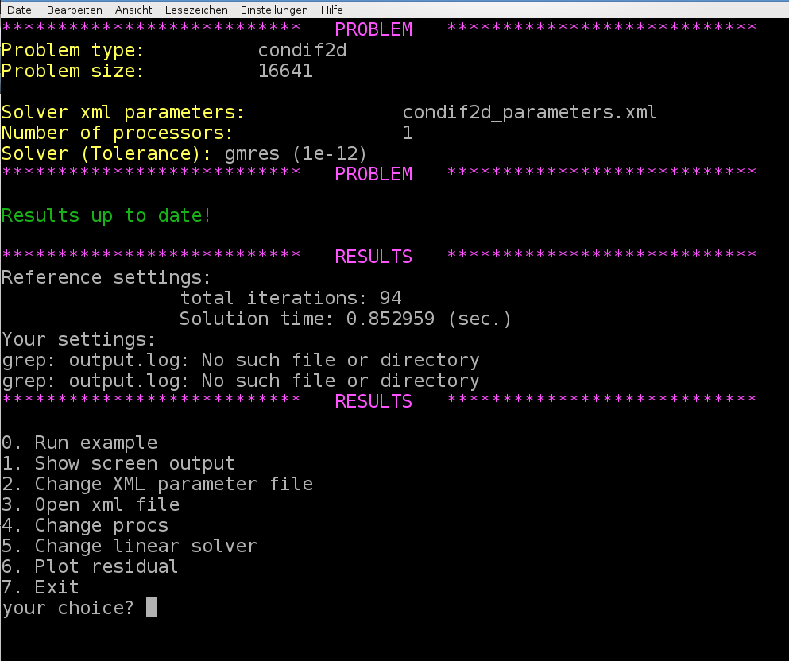

=====================
Challenge: CD example
=====================

Practical example
=================

Often one has only very rough information about the linear system that is supposed to be effectively solved using iterative methods with multigrid preconditioners. Therefore, it is highly essential to gain some experience with the solver and preconditioner parameters and learn to optimize the multigrid parameters just by looking at the convergence behavior of the linear solver.

Here, we consider a convection-diffusion example with :math:`16641` degrees of freedom. No further information is provided (geometry, discretization technique, ...).

User-interface
==============

Run the *hands-on.sh* script and choose the option 4 for the convection-diffusion example. The script automatically generates a XML file with reference multigrid parameters which are far from being optimal.

When using the reference settings for the multigrid preconditioner we need 85 linear iterations. The challenge is to find optimized multigrid settings which results in a significantly lower number of linear iterations and -- even more important -- a lower computational time.

.. note::
    Please notice that we have automatically chosen GMRES as solver as the linear systems arising from convection-diffusion problems are non-symmetric (due to the convective term). A CG methods would not converge.

.. admonition:: Exercise 1

    Open the *Recirc2D_parameters.xml* file by pressing option 3. Try to find optimized multigrid settings using your knowledge from the previous tutorials. Save the file and rerun the example (using option 0). Compare your results with the reference results. With option 6 you can plot the convergence of the relative residual of the iterative solver (for comparison).

.. _cd_example/generalhints:

General hints
=============

There is a very simple strategy for optimizing the solver and preconditioner parameters iteratively that works for many examples surprisingly well.

Linear solver settings
----------------------

The parameters for the linear solver usually are fixed. Just make sure that you consider the non-symmetry in the choice of your iterative method and choose the solver tolerance in a reasonable way. Before you think about finding good preconditioner parameters you should be absolutely sure that your linear solver is chosen appropriately for your problem.

General multigrid settings
--------------------------

Next, one should choose the multigrid settings. This includes the desired number of multigrid levels and the stopping criterion for the coarsening process. An appropriate choice here is mainly dominated by the size of the problem and the discretization. The multigrid parameters should be chosen such that one obtains a reasonably small problem on the coarsest level which is solved directly.

Transfer operators
------------------

Then, one should think about the transfer operators. In the symmetric case one can try smoothed aggregation transfer operators. If unsure, the non-smooth transfer operators always should be a safe and robust starting point.

Level smoothers
---------------

Once the multigrid skeleton is fixed by the choice of transfer operators one can start with optimizing the level smoothers. When using relaxation based level smoothers one should first try different smoothing parameters and increase the number of smoothing sweeps only when necessary.

Fine tuning
-----------

Sometimes it is very helpful to have a look at the multigrid matrices.
First of all, one should check whether the aggregation is working properly. This can be done by checking the screen output for the coarsening rate and the aggregation details (this is often the only way to do it if aggregates cannot be visualized due to missing node coordinates). If there is some problem with the aggregation one should try to adapt the aggregation parameters. Here it might make sense to export the coarse level matrices first and study their properties. For finding aggregation parameters one should, e.g., check the number of non-zeros in each row and choose the minimum aggregation size accordingly.