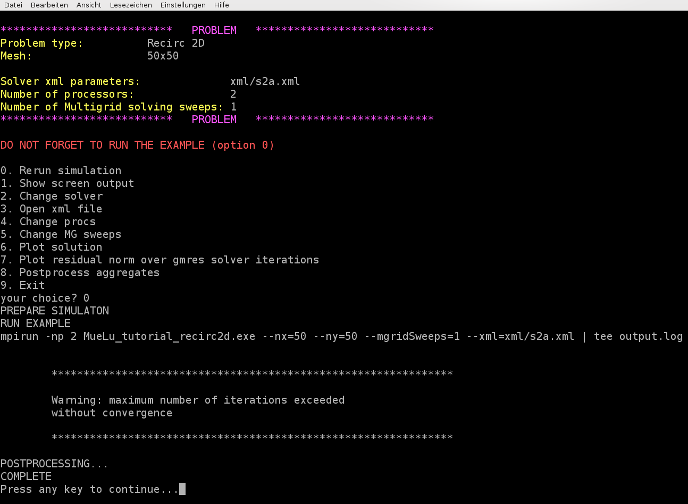

====================================
Multigrid for non-symmetric problems
====================================

.. _multigrid_for_non_symmetric_problems/test_example:

Test example
============

The **Recirc2D** example uses a matrix corresponding to the finite-difference discretization of the problem

.. math::
    -\varepsilon\Delta u + (v_x,v_y)\cdot \nabla u=f

on the unit square, with :math:`\varepsilon=1e-5` and homogeneous Dirichlet boundary conditions.
It is :math:`v_x=4x(x-1)(1-2y)` and :math:`v_y=-4y(y-1)(1-2x)`.
The right hand side vector :math:`f` is chosen to be the constant vector 1.
Due to the convective term the resulting linear system is non-symmetric and therefore more challenging for the iterative solver.
The multigrid algorithm has to be adapted to the non-symmetry to obtain good convergence behavior.

User interface
==============

For this tutorial again we can use the easy-to-use user interface.
Run the **hands-on.py** script in your terminal and choose option 2 for the **Recirc 2D** example on a :math:`50\times 50` mesh.
Note that the default values from the file **../../../test/tutorial/s2a.xml** do not lead to a convergent multigrid preconditioner.

The convergence of the used unsmoothed transfer operators (**multigrid algorithm = unsmoothed**) is not optimal.
In case of symmetric problems one can reduce the number of iterations using smoothed aggregation algebraic multigrid methods.
In context of non-symmetric problems, especially when arising from problems with (highly) convective phenomena,
one should use a Petrov-Galerkin approach for smoothing the prolongation and restriction operators more carefully.

In MueLu one can choose a Petrov-Galerkin approach for the transfer operators by setting **multigrid algorithm = pg**.
Furthermore, one has to state that the system is non-symmetric by setting **problem: symmetric = false**.
In addition, you have to set **transpose: use implicit = false** to make sure that the prolongation and restriction are built separately.
This is highly important for non-symmetric problems since :math:`R=P^T` is not a good choice for non-symmetric problems (see, e.g., [1]_ [2]_).

The role of the **transpose: use implicit** and the **problem: symmetric** parameters are the following:

.. admonition:: Description

    * **transpose: use implicit** Use :math:`R=P^T` for the restriction operator and do not explicitly build the operator :math:`R`.
    This can save a lot of memory and might be very performant when building the multigrid Galerkin product.
    However, for non-symmetric problems this is not working and has to be turned off.
    * **problem: symmetric** If **true**, use :math:`R=P^T` as restriction operator.
    Depending on the **transpose: use implicit** parameter the restriction operator is explicitly built.
    If **false** a Petrov-Galerkin approach as described in [1]_ is used to build the restriction operator separately.
    Note, that for the Galerkin approach it is necessary to build the restriction operator explicitly and store it.

.. note::

    One can also use unsmoothed transfer operators (**multigrid algorithm = unsmoothed**) for non-symmetric problems.
    These might not give optimal results with respect to the iteration count,
    but they can be used with **transpose: use implicit = true** for non-symmetric problems, too, without disturbing the convergence.
    This way one can save a significant amount of memory compared to the smoothed aggregation method with Petrov-Galerkin for non-symmetric problems.

.. admonition:: Exercise 1

    Choose the parameters from the **n1_easy.xml** file.
    If you run the example you might find that the GMRES method did not converge within 50 iterations.
    Use **multigrid algorithm = pg** and compare the results with **multigrid algorithm = unsmoothed**.
    Do not forget to set the other parameters correctly for Petrov-Galerkin methods as described before.
    What is the difference in the number of GMRES iterations?
    What is changing in the multigrid setup?

.. admonition:: Exercise 2

    For slightly non-symmetric problems the **sa** method often performs satisfactorily.
    Change the verbosity to high (**verbosity = high**)
    and compare the results of the **multigrid algorithm = pg** option with the **multigrid algorithm = sa** option.
    Check the role of the **transpose: use implicit** parameter.
    What is changed by the **problem: symmetric** parameter?
    Try different values between 0 and 1.5 for the damping parameter within the smoothed aggregation method
    (i.e., try values 0.0, 0.5, 1.0, 1.33 and 1.5 for **sa: damping factor**).
    What do you observe?

Footnotes
=========
.. [1] Sala, M. and Tuminaro, R. S., A new Petrov-Galerkin Smoothed Aggregation Preconditioner for nonsymmetric Linear Systems, SIAM J. Sci. Comput., 2008, 31, p. 143–166
.. [2] Wiesner, T. A., Tuminaro, R. S., Wall, W. A. and Gee, M. W., Multigrid transfers fornonsymmetric systems based on Schur complements and Galerkin projections., Numer.Linear Algebra Appl., 2013, doi: 10.1002/nla.1889
