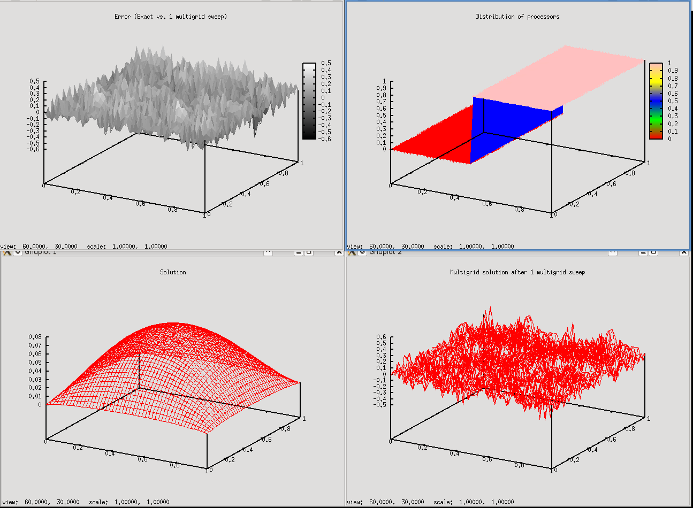
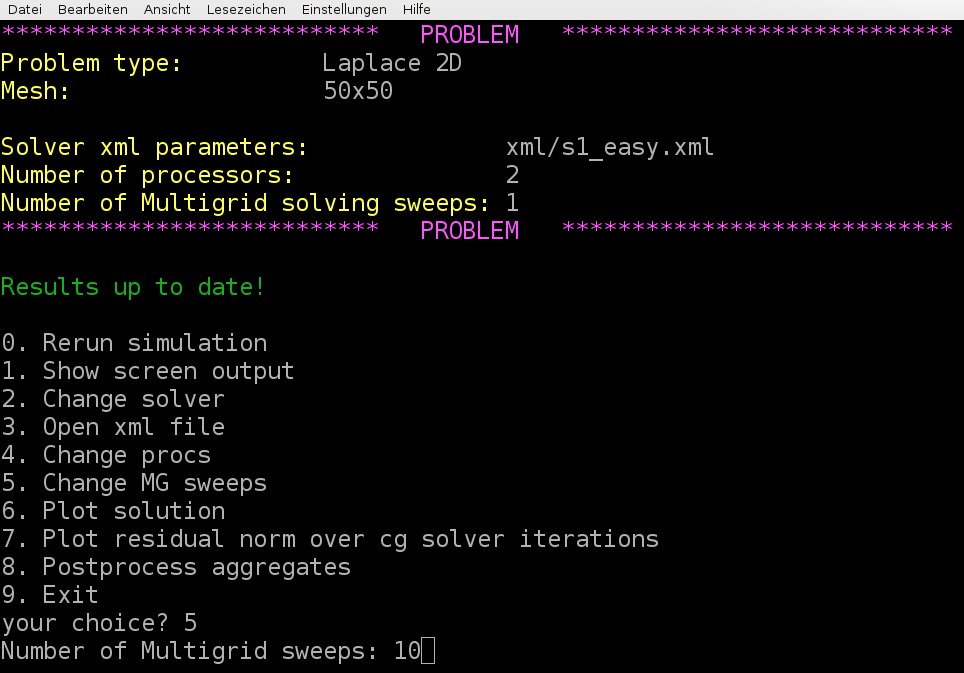
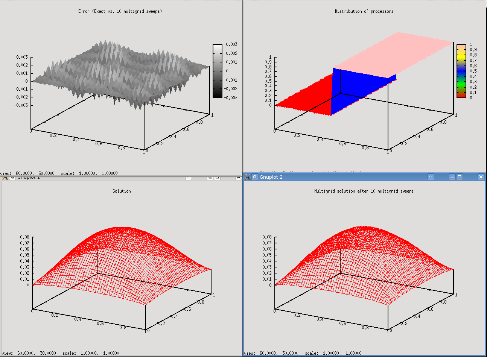
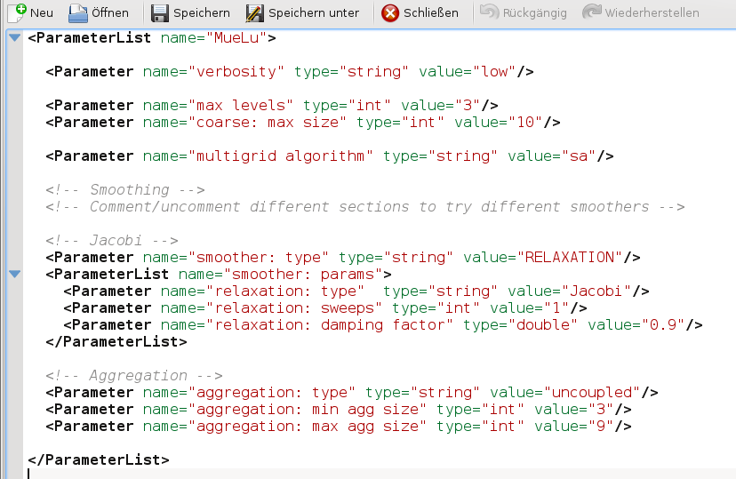

===========
Quick start
===========

The first example is meant to quickly get into touch with MueLu.

.. _quick_start/example problem:

Example problem
===============

We generate a test matrix corresponding to the stencil of a 2D Laplacian operator on a structured Cartesian grid.
The matrix stencil is

.. math::
   \frac{1}{h^2}\begin{pmatrix} & -1 & \\ -1 & 4 & -1 \\ & -1 & \end{pmatrix}

where :math:`h` denotes the mesh size parameter.
The resulting matrix is symmetric positive definite.
We choose the right hand side to be the constant vector one
and use a random initial guess for the iterative solution process.
The problem domain is the unit square with a Cartesian (uniform) mesh.

User interface
====================

For this tutorial there is an easy-to-use user interface to perform some experiments with multigrid methods for the given problem as described in :ref:`quick_start/example problem`. To use the user-interface run **./hands-on.py** in a terminal in the Trilinos build directory's **packages/muelu/test/tutorial** folder. From this point forward, we will provide all paths relative to that folder in the build directory.
First one has to choose a problem. For this tutorial, select option 0 for the Laplace 2D problem on a :math:`50 \times 50` mesh.

.. literalinclude:: output/quick_start_1.txt

Next one has to choose a xml file with the multigrid parameters. Choose option 2 and put in **s1_easy.xml** as filename for the xml file containing the xml parameters that are used for the multigrid method.

.. note::

  Please make sure that you enter a filename that actually exists on your hard disk!

.. literalinclude:: output/quick_start_2.txt

The s1_easy.xml file has the following content

.. literalinclude:: ../../../test/tutorial/s1_easy.xml
  :language: xml
  :caption:

As one can easily find from the xml parameters, a multigrid method with not more than 3 levels and a damped Jacobi method for level smoothing shall be used.
Next, choose option 0 and run the example. That is, the linear system is created and iteratively solved both by a preconditioned CG method with a MueLu multigrid preconditioner and a standalone multigrid solver (again using MueLu) with the given multigrid parameters.

.. literalinclude:: output/quick_start_3.txt

Note that the line **mpirun -np 2 MueLu_TutorialDriver.exe --matrixType=Laplace2D -nx ...** is the command that is executed in the background. The default is 2 processors used.
After pressing a key we are ready for a first analysis as it is stated by the green letters **Results up to date!**

.. literalinclude:: output/quick_start_4.txt

.. note::

  If the results are not up to date always choose option 0 first to recalculate the results.

To check the output select option 1. This should produce the following output on screen.

.. program-output:: mpiexec -n 2 ../../../test/tutorial/MueLu_TutorialDriver.exe --matrixType=Laplace2D --nx=50 --ny=50 --mgridSweeps=1 --xml=../../../test/tutorial/s1_easy.xml

.. note::

  Depending on the number of lines in your terminal you may have to scroll up to the top of the file

These lines give you some information about the setup process with some details on the aggregation process and the transfer operators. Note that for this example three levels are built: Level 0 for the finest level, level 1 as intermediate level and level 2 for the coarsest level. Then an overview of the different multigrid levels is given by

.. warning::

  Insert screen output

One can see that a three level multigrid method is used with a direct solver on the coarsest level and Jacobi level smoothers on the fine and intermediate level. Furthermore some basic information is printed such as the operator complexity.

In the end the CG convergence is printed when applying the generated multigrid method as preconditioner within a CG solver. The numbers give the relative residual after the corresponding number of iterations as well as the solution time in seconds.

.. warning::

  Insert screen output

Selecting option 6 gives you four plots.

The lower left plot shows the exact solution of the linear system (using a direct solver from the Amesos package). The lower right plot shows the multigrid solution when 1 sweep with a V-cycle of the multigrid method as defined in the xml parameter file is applied to the linear system as a standalone multigrid solver. As one can see, the multigrid solution with a random initial guess is far away from the exact solution. The upper left plot shows the difference between the multigrid solution and the exact solution. Finally, the upper right plot shows the distribution of the fine level mesh nodes over the processors (in our example we use 2 processors).

.. note::

  The plots do not show the solution of the preconditioned CG method! The solution of the CG method is always exact up to a given tolerance as long as the multigrid preconditioner is sufficient. This can be checked by the screen output under option 1.

As a first experiment we change the number of multigrid sweeps for the stand alone multigrid smoother. Let's choose option 5 and use 10 multigrid sweeps.

Then, do not forget to rerun the examples to update the results. That is, choose option 0 and wait for the simulation to finish. Then plot again the results using menu option 6 and you should obtain

As one can see is the multigrid solution rather close to the exact solution. In the error plot one finds some low and high frequency error components.

.. admonition: Exercise 1

  Change the number of processors. Use option 4 and select for example 4 processors (instead of 2). Rerun the example and plot the results.

  .. image:: pics/tut1_9.png
    :width: 10cm

.. admonition: Exercise 2

  Compare the output when using 4 processors with the output for only 2 processors. Is the number of aggregates changing? Is there some effect on the quality of the multigrid solution? How does the number and convergence history change for the preconditioned CH method?

.. admonition: Exercise 3

  Choose option 8 to close the program

The XML input deck - multigrid parameters
-----------------------------------------
After we have learned the basics of the driver program for our experiments we now perform some experiments with our multigrid methods. We again use the simple 2D Laplace problem. First, we create a copy of the solver parameters using

**cp s1_easy.xml mysolver.xml**

Then, we run the driver program again using

**./hands-on.sh**

and choose option 0 for the 2D-Laplace example on the **50\times50** mesh. Use the xml parameters from the **mysolver.xml**`file, that is, choose option 2 and put in **mysolver.xml**. Make sure that the problem can be solved with the parameters (option 0) and verify the solver output.
Once that is done it is time for some first experiments. Open your **mysolver.xml** file in a text editor. You can try option 3 for doing that, but alternatively you can also do it by hand choosing your favorite text editor.

Now, let's change the maximum number of multigrid levels from 3 to 10 in the xml file, that is, change the value of the parameter **max levels** from 3 to 10. Do not forget to save the file and rerun the example by choosing option 0 in the driver program. The screen output should be the following

.. warning::

  Insert missing output

.. note::

  Even though we allow for at maximum 10 multigrid levels the coarsening process stops after level 4. The reason is that the linear operator on multigrid level 4 has only 4 lines and therefore is smaller than the coarse: max size parameter in the xml parameter list which defines the maximum size of the linear operator on the coarsest level.

.. admonition: Exercise 4

  How do you have to choose the coarse: max size parameter to obtain a 3 level multigrid method again? Increase the parameter accordingly, rerun the simulation and check your results.

.. admonition: Exercise 5

  What happens if you allow only for a 1 level method (i.e., no multigrid)? How does this affect the preconditioned CG method?

The option sa for **smoothed aggregation** in the multigrid algorithm parameter can be considered to be optimal for symmetric positive definite (SPD) problems. We can compare it with the option unsmoothed as a robust but slower alternative. Let’s choose a 3 level multigrid method with unsmoothed transfer operators (i.e., max levels = 3, multigrid algorithm = unsmoothed), then we obtain

.. warning::

  Insert missing output

Compared with the smoothed aggregation method (multigrid algorithm = sa) which uses some smoothed transfer operator basis functions within the multigrid method, the unsmoothed multigrid algorithm needs a significantly higher number of iterations. The same method with smoothed transfer operator basis functions gives

.. warning::

  Insert missing output

.. note::

  You can find the corresponding xml files also in **../../../test/tutorial/s1_easy_3levels_smoothed.xml**

.. admonition: Exercise 6

  Compare the screen output of the unsmoothed multigrid method and the smoothed aggregation multigrid method. Which parts are missing in the multigrid setup for the unsmoothed multigrid method? How does the multigrid method affect the aggregates?

.. admonition: Exercise 7

  Performing 10 multigrid sweeps both with the unsmoothed and the smoothed aggregation multigrid method gives the following error plots

  .. image:: pics/tut1_11.png
    :width: 10cm

  .. image:: pics/tut1_12.png
    :width: 10cm

  Which one belongs to the unsmoothed multigrid method?

