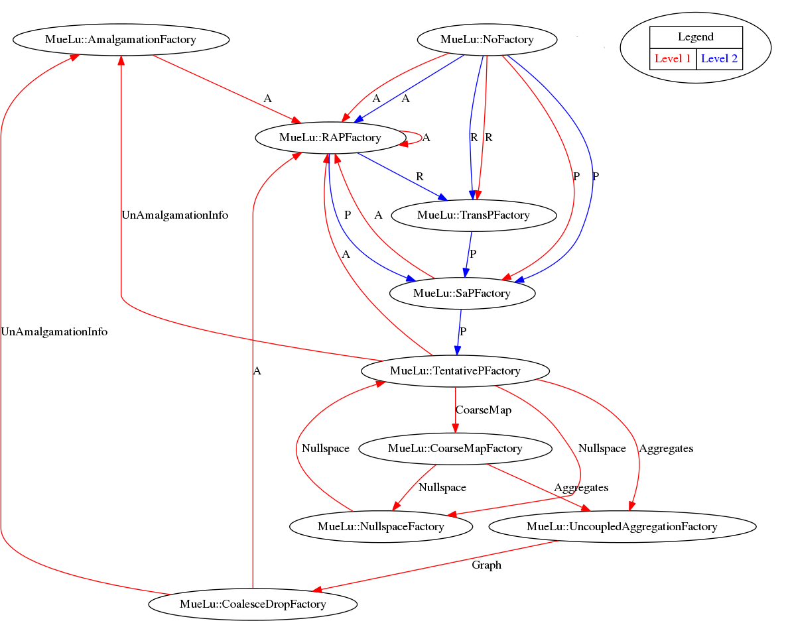
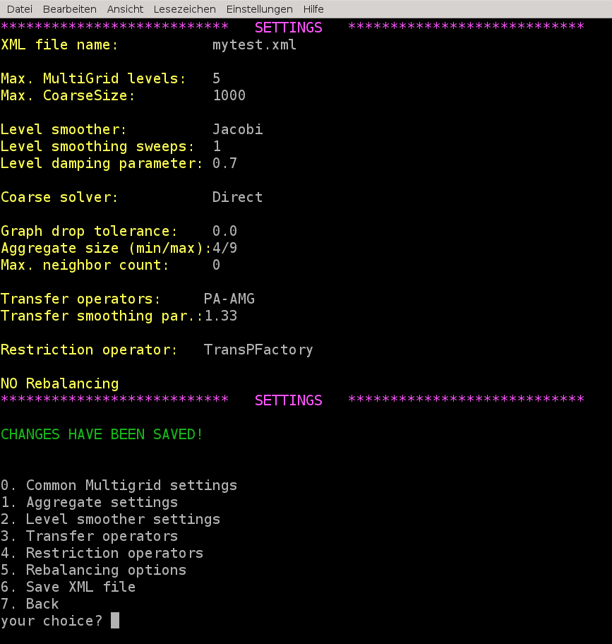

=============================
Useful commands and debugging
=============================

Export level information
========================

Of course, it is possible to export the multigrid hierarchy in matrix market format similar to :ref:`useful_tools_for_analysis/export_data` when using the advanced XML file format instead of the simple XML format.

To export the multigrid hierarchy one can use, e.g., the following parameters

.. literalinclude:: ../../../test/tutorial/s6_export.xml
  :language: xml

.. _useful_commands_and_debugging/dependencytrees:

Dependency trees
================

For debugging it can be extremely helpful to automatically generate the dependency tree of the factories for a given XML file. However, it shall be noticed that even with a graphical dependency tree it might be hard to find the missing links and dependencies without a sufficient understanding of the overall framework.

To write out the dependencies you just have to put in the **dependencyOutputLevel** parameter. The value gives you the fine level index that you are interested in (e.g., 1 means: print dependencies between level 1 and level 2).

.. literalinclude:: ../../../test/tutorial/s6_dep.xml
  :language: xml
  :caption:

After running the example you should find a file named **dep_graph.dot** in the current folder which you can transform into a graph using the **dot** utility from the graphviz package.
Run, e.g. the commands

::
    sed -i 's/label=Graph\]/label=\"Graph\"\]/' dep_graph.dot
    sed -i 's/\\"/"/g' dep_graph.dot
    sed -i 's/"</</' dep_graph.dot
    sed -i 's/>"/>/' dep_graph.dot
    dot -Tpng dep_graph.dot -o dep_graph.dot.png

in your terminal to obtain the graph as given in Figure :ref:`useful_commands_and_debugging/autograph`.

.. _useful_commands_and_debugging/autograph:

    Visualization of aggregates using the CoarseningVisualizationFactory.

Note that the red arrows correspond to the fine level (level 1) and the blue arrows correspond to data on the coarse level (level 2).

.. note::

    In case that the file **dep_graph.dot** is not generated you have to check the prerequisites. To be able to auto-generate the dependency graphs you have to compile MueLu with Boost enabled. Furthermore you have to set the **MueLu_ENABLE_Boost_for_real:BOOL = ON** defines flag in your configuration script. If these requirements are not fulfilled you should find the error message *Dependency graph output requires boost and MueLu_ENABLE_Boost_for_real* in the screen output of MueLu.

As one can see from the dependency output there are also some internal factories which have not been visualized in the Figures :ref:`muelu_factories_for_transfer_operators/figure_simpledesign`. A good example is the **NullspaceFactory** which seems to build a dependency cycle with the **TentativePFactory**. In fact, the **NullspaceFactory** is a helper factory which allows to use the user-provided near null space vectors as input on the finest level. On the coarser levels it just loops through the generated coarse set of near null space vectors from the **TentativePFactory**. This is a technical detail which sometimes can cause some problems when the corresponding dependency is not defined properly in the XML file.
Another example for a special factory is the **NoFactory**. This special factory is used for all data which is kept in memory and needed by the level smoothers during the iteration. Usually, the final transfer operators :math:`P` and :math:`R` as well as the level matrix :math:`A` are transformed to **NoFactory** objects after the setup phase has completed. However, expert users can also use the **NoFactory** mechanism for special data during the setup phase. But this is not recommended.

.. admonition:: Exercise 1

    Compare the factory layout in Figure :ref:`aggregation/figure_simpledesignaggregates` with above dependency graph. Try to read it from bottom to top. Which factories are missing in Figure :ref:`aggregation/figure_simpledesignaggregates`? Which variables are missing in Figure :ref:`aggregation/figure_simpledesignaggregates`?

Graphical assistant for XML file generation
===========================================

The **hands-on.py** driver script contains a graphical assistant to generate new XML parameter files in the advanced MueLu file format.

Just run the **hands-on.py** script and choose a problem type from the list. Then choose option 2 to set the xml file. If you enter a filename that does not exist then the assistant is started to generate that new XML file.

Just go through the menu and make your choices for level smoothers, transfer operators and so on. Do not forget to call option 6 to save the XML file under the given name, that you have entered before. Then you can use option 7 to go back to the main menu for the example problem and try your new preconditioner with your parameter choices.

.. note::
    Of course, we could have introduced this feature with the earlier tutorials, but the idea was to familiarize the user with the XML files.
