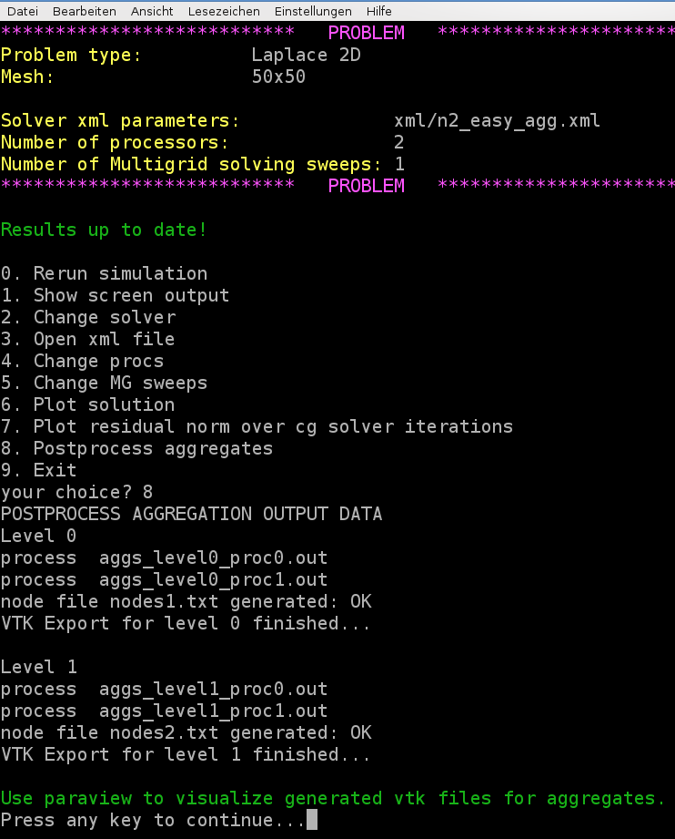
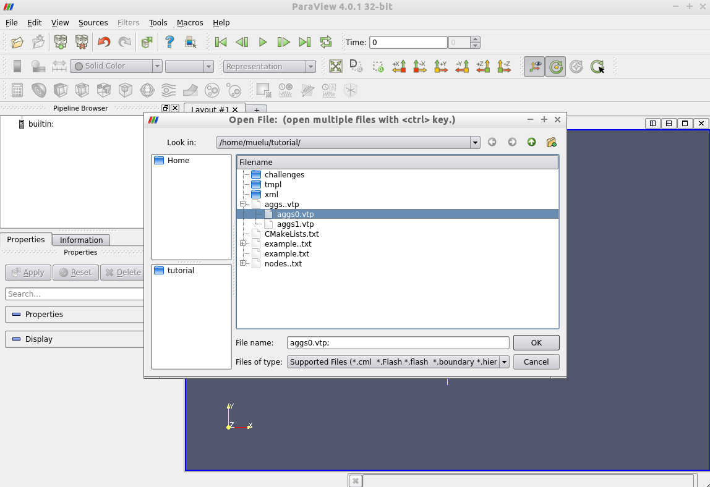
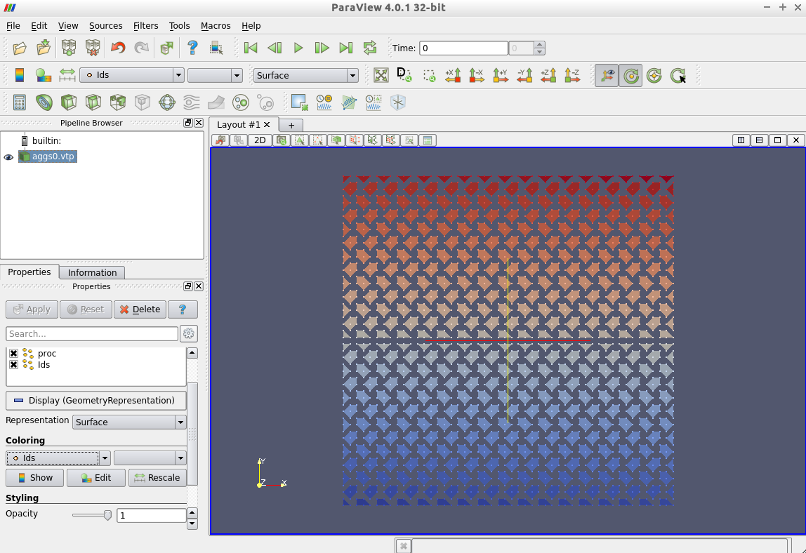
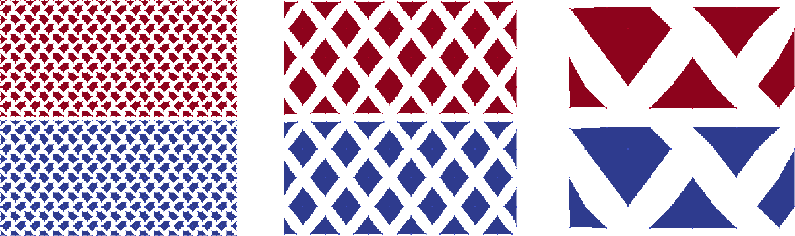
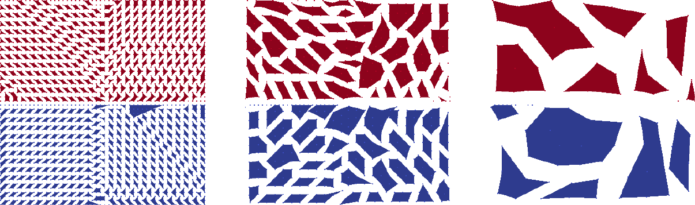

=========================
Useful tools for analysis
=========================

Visualization of aggregates
===========================

Technical prerequisites
-----------------------

MueLu allows one to export plain aggregation information in simple text files that may be interpreted by post-processing scripts to generate pictures from the raw data. The post-processing script provided with the MueLu tutorial is written in python and produces VTK output. Please make sure that you have all necessary python packages installed on your machine (including **python-vtk**).

.. note::

    The visualization script has successfully been tested with VTK 5.x. Note that it is not compatible to VTK 6.x.

Visualization of aggregates with MueLu using VTK
------------------------------------------------

We can visualize the aggregates using the vtk file format and a visualization program called ParaView. First add the parameter **aggregation: export visualization data = true** to the list of aggregation parameters. Use, e.g., the following xml file **../../../test/tutorial/n2_easy_agg.xml**.

Run the **hands-on.py** script and select, e.g., the Laplace 2D example on a :math:`50\times 50` mesh. Select above xml file for the multigrid parameters with the **aggregation: export visualization data** enabled. Run the program and then choose option 8 for post-processing the aggregates.

.. note::

    Be aware that without **aggregation: export visualization data = true** the post processing step for the aggregates will fail.

Once the visualization data is exported and post-processed you can run *ParaView* (if it is installed on your machine) and open the files **aggs0.vtp** and **aggs1.vtp** for visualization.

Start *ParaView* and open the files **aggs0.vtp** and/or **aggs1.vtp**. Do not forget to press the *Apply* button to show the aggregates on screen.

Then the aggregates should be visualized as follows.

Here the colors represent the unique aggregate id. You can change the coloring in the left column from *Ids* to *proc* which denotes the owning processor of the aggregate.

Figure :ref:`useful_tools_for_analysis/figure_aggsSymm` shows the aggregates for the Laplace2D problem on the different multigrid levels starting with an isotropic :math:`50\times 50` mesh. No dropping of small entries was used when building the matrix graph (**aggregation: drop tol=0.0**). For visualization purposes the *midpoint* of each aggregate defines the coordinate of the supernode on the next coarser level. Be aware that these supernodes are purely algebraic. There is no coarse mesh for algebraic multigrid methods. As one can see from the colors an uncoupled aggregation strategy has been applied using 2 processors. The aggregates do not cross the processor boundaries.

.. _useful_tools_for_analysis/figure_aggsSymm:

    Aggregates for Laplace2D example on :math:`50\times 50` mesh without dropping.

.. admonition:: Exercise 1

    Repeat above steps for the *Recirc2D* example on a :Math:`50\times 50` mesh. Compare the aggregates from the **../../../test/tutorial/n2_easy_agg.xml** parameter file with the aggregates when using the **../../../test/tutorial/n2_easy_agg2.xml** parameter file, which drops some small entries of the fine level matrix :math:`A` when building the graph.

.. admonition:: Exercise 2

    Vary the number of processors. Do not forget to export the aggregation data (option 7) after the simulation has rerun with a new number of processors. In *ParaView* choose the variable *proc* for the coloring. Then the color denotes the processor the aggregate belongs to. How do the aggregates change when switching from 2 to 3 processors?
    *  Try the solver parameters from **../../../test/tutorial/s4c.xml** or the *Recirc2D* example on a :math:`50\times 50` mesh and compare them with the results for the **../../../test/tutorial/s4a.xml** and **../../../test/tutorial/s4b.xml** parameters. Which differences do you observe?

Figure :ref:`useful_tools_for_analysis/figure_aggsNonSymm` shows the aggregates for the Recirc2D problem. When building the matrix graph, entries with values smaller than :math:`0.01` were dropped. Obviously the shape of the aggregates follows the direction of convection of the example. Using an uncoupled aggregation method (i.e., **aggregation: type = uncoupled**) as default the aggregates do not cross processor boundaries.

.. _useful_tools_for_analysis/figure_aggsNonSymm:

    Aggregates for Recirc2D example on :math:`50\times 50` mesh with dropping.

.. _useful_tools_for_analysis/export_data:

Export data
===========

For debugging purposes it can be very helpful to have a look at the coarse level matrices as well as the transfer operators. MueLu allows one to export the corresponding operators to the matrix market format such that the files can be imported, e.g., into MATLAB (or `FreeMat <http://freemat.sourceforge.net/>`_) for some in-depth analysis.

The following xml file writes the fine level operator and the coarse level operator as well as the prolongation and restriction operator to the hard disk using the filenames **A_0.m**, **A_1.m** as well as **P_1.m** and **R_1.m**

.. literalinclude:: ../../../test/tutorial/n2_easy_export.xml
  :language: xml
  :caption:

.. note::

    Be aware that there is no prolongator and restrictor on the finest level (level 0) since the transfer operators between level :math:`\ell` and :math:`\ell+1` are always associated with the coarse level :math:`\ell +1` (for technical reasons). So, be not confused if there is no **P_0.m** and **R_0.m**. Only the operators are written to external files which really exist and are requested in the corresponding list in the xml parameters.

The exported files can easily imported into MATLAB and used for some in-depth analysis (determining the eigenvalue spectrum, sparsity pattern,...).
