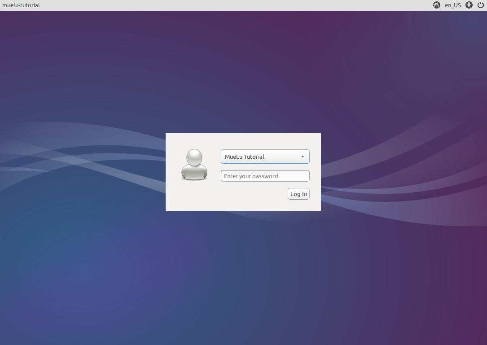
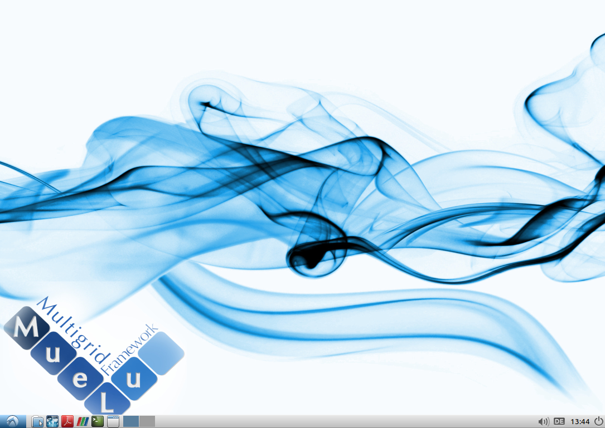
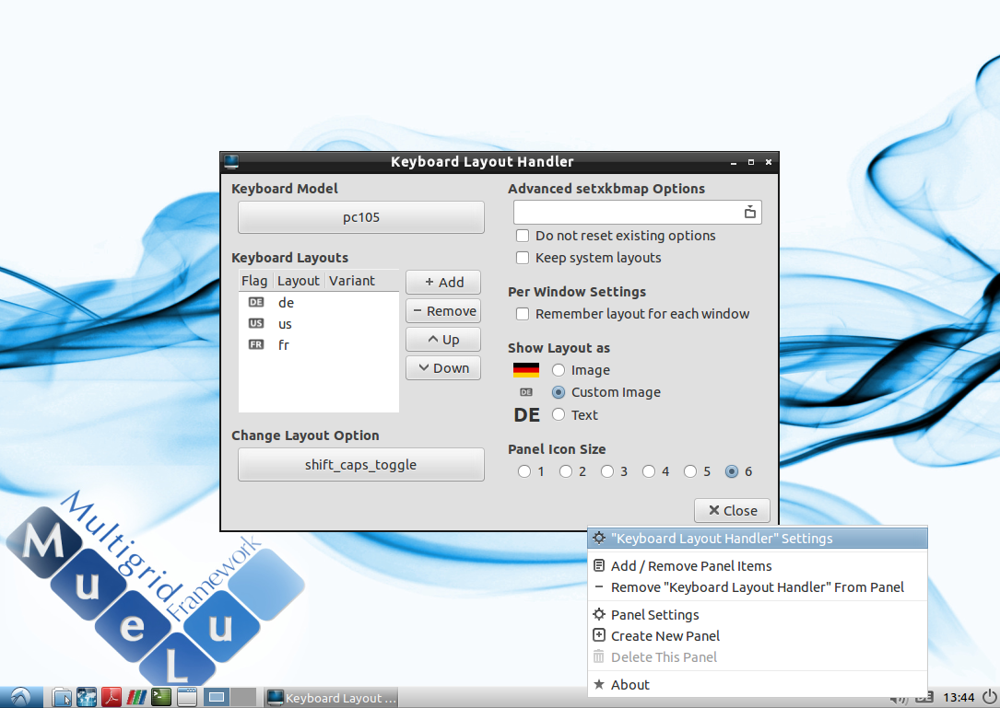
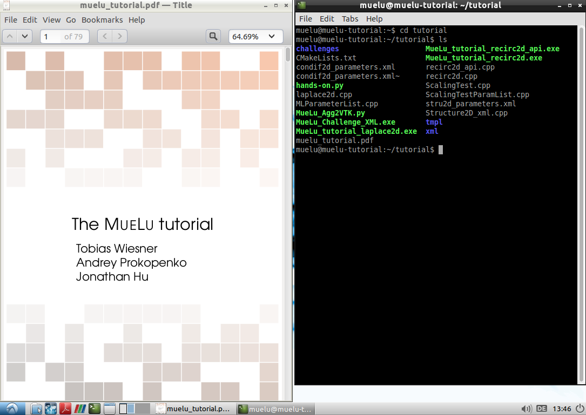
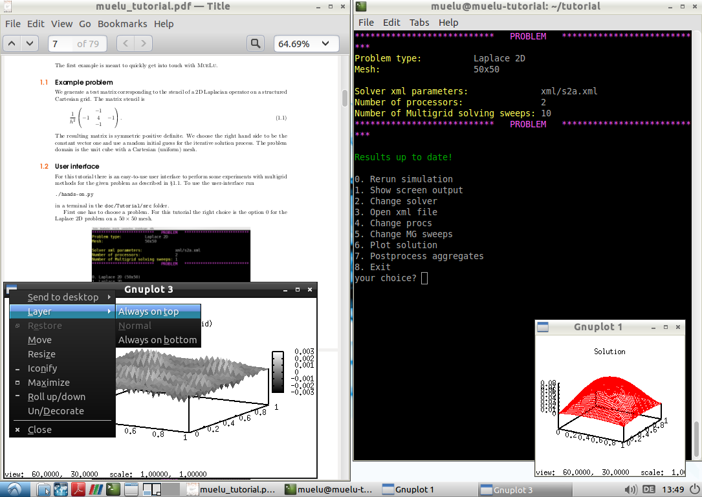
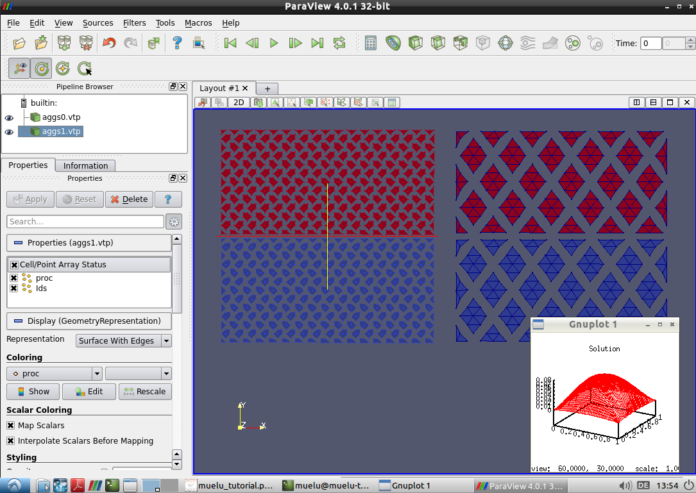

====================
A. Virtual box image
====================

This chapter discusses the basics of the virtual box image that comes with this tutorial to allow the user to follow above explanations and do its own experiments with MueLu and Trilinos. A virtual machine has the advantage that it is rather easy to set up for a user. Even though compiling and installing got easier the last years by using a cmake based build system it is still a nightmare for not so experienced users. The virtual machine runs both on Linux and Windows as host and brings all the necessary tools for a quick start to MueLu.

Preparations
============

To use the virtual machine you basically have to perform the following steps.

#. Install **VirtualBox** on your host machine. You can download it from **www.virtualbox.org**.
#. Download the **MueLu_Tutorial.ova** virtual machine. The image file has 4 GB.
#. Run **VirtualBox** and import the **MueLu_Tutorial.ova** machine. 

    .. figure:: pics/installation_1.png
     
    
    Then, check and adapt the settings of the virtual machine.
     
    .. figure:: pics/installation_2.png
        
    
    In general, one processor should be enough. But if you want to make some more reasonable tests with parallel multigrid you should increase the number of processors accordingly. Click import, to import the virtual machine.

#. With a click on the start button the virtual machine is booting.

First steps
===========

Login and setup
---------------

Once the virtual machine is started you first have to login.

The login data is:

::

    Username: muelu 
    Password: sandia

.. note::

    You only need to enter the password in above screen.

After the login you should see the following desktop.

First, you should adapt the language settings and the keyboard layout. You can switch the keyboard layout by clicking on the logo in the lower right corner. A right click on the logo allows you to change more details

Then you are ready to go with the tutorial.

MueLu tutorial
--------------

Open the tutorial with **evince** as pdf viewer. To open **evince** you can either use the shortcut in the lower left corner of your desktop or press :kbd:`Alt` + :kbd:`F2` to open the **Run** dialog and enter **evince**. Load the **muelu_tutorial.pdf** file in the **tutorial** folder of your home directory.

To open a terminal you have several option. Either use the shortcut button in the lower left corner. Alternatively you can open the **Run** dialog (:kbd:`Alt` + :kbd:`F2`) and enter **lxterminal**. As a third alternative you can just press :kbd:`Ctrl`+ :kbd:`Alt` + :kbd:`T`. In the terminal, change to the **tutorial** folder by entering **cd tutorial**. Therein you can find the **hands-on.py** script which is used throughout the whole MueLu tutorial.

.. note::
    Use the :kbd:`Win` + :kbd:`<-` and :kbd:`Win` + :kbd:`->` keys to arrange the windows in a split view as shown above.
    There are other useful keyboard shortcuts such as :kbd:`Win` + :kbd:`R` to open the **Run** dialog or :kbd:`Win` + :kbd:`E` to open the file manager.

When plotting the results with gnuplot from within the **hands-on.py** script it might be useful to make the plot windows to stay on top.

The virtual machine has all software installed that you need to follow the tutorial (including **paraview**)

Software
========

The virtual machine is based on a minimal installation of **Lubuntu 14.04**. The image file has 4 GB with about 250 MB free for the user.

The following software is pre-installed:

::

    Web-browser: midori 
    PDF-viewer: evince 
    Terminal: LXTerminal
    Visualization: paraview, gnuplot 
    File manager: PCManFM 
    Analysis: FreeMat v4.0 
    GNU octave 3.8.1

The following system libraries are installed:

::

    Trilinos: Trilinos (developer branch: Oct 1, 2014) 
    Direct solver: SuperLU 4.3 
    VTK: VTK 5.8 
    MPI: OpenMPI 1.6.5 
    Python: Python 2.7.6 
    Compiler: gcc 4.8.2

