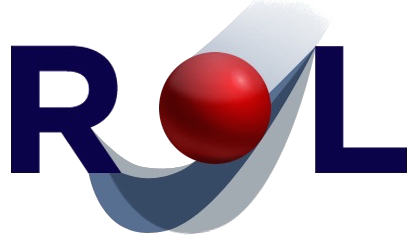

# Rapid Optimization Library (ROL) Package

**ROL** (as in rock and _roll_) is a high-performance C++ library for numerical optimization.
ROL brings an extensive collection of state-of-the-art optimization algorithms to virtually
any application. Its programming interface supports any computational hardware, including
heterogeneous many-core systems with digital and analog accelerators. ROL has been used with
great success for optimal control, optimal design, inverse problems, image processing and
mesh optimization, in application areas including geophysics, structural dynamics, fluid
dynamics, electromagnetics, quantum computing, hypersonics and geospatial imaging.

For additional details, see [https://rol.sandia.gov](https://rol.sandia.gov).

Feature highlights:

1. Vector abstractions and matrix-free interface for universal applicability
2. Modern algorithms for unconstrained and constrained optimization
3. Easy-to-use methods for stochastic and risk-aware optimization
4. Fast and robust algorithms for nonsmooth optimization
5. Trust-region methods for inexact and adaptive computations
6. PDE-OPT application development kit for PDE-constrained optimization

## Copyright and License
See rol/COPYRIGHT, rol/LICENSE, https://trilinos.github.io/license.html and individual file headers for additional information.

## Questions? 
Contact lead developers:

* ROL team     (GitHub handle: @trilinos/rol)
* Drew Kouri   (GitHub handle: [dpkouri](https://github.com/dpkouri) or dpkouri@sandia.gov)
* Denis Ridzal (GitHub handle: [dridzal](https://github.com/dridzal) or dridzal@sandia.gov)

