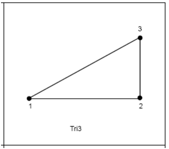
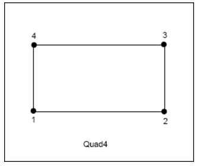
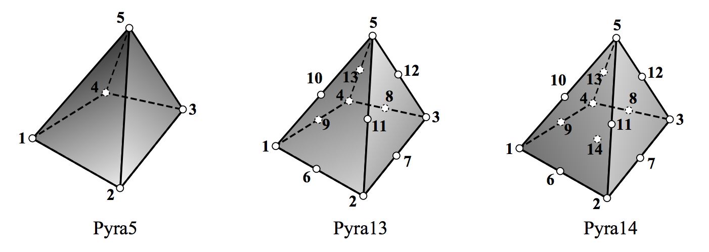

\page element_types Exodus Element Types

\tableofcontents

\section types Element Types
The following table shows the element types supported in the Exodus
library, the IOSS library, nem_slice, and nem_spread.

 Element |Nodes|Exodus| IOSS  | nem_slice | nem_spread |
 --------|:---:|:----:|:-----:|:---------:|:----------:|
 |circle |  1  |  X   |    X  |    X      |  X |
 |sphere |  1  |  X   |    X  |    X      |  X |
 |       |     |      |       |           |    |
 |beam   |  2  |  X   |    X  |    X      |  X |
 |       |  3  |  X   |    X  |    X      |  X |
 |       |  4  |  X   |    X  |           |    |
 |       |     |      |       |           |    |
 quad    |  4  |  X   |    X  |    X      |  X |
 |       |  5  |  X   |       |           |    |
 |       |  8  |  X   |    X  |           |    |
 |       |  9  |  X   |    X  |    X      |  X |
 |       | 12  |  X   |    X  |           |    |
 |       | 16  |  X   |    X  |           |    |
 |       |     |      |       |           |    |
 tri (2D)|  3  |  X   |    X  |    X      |  X |
 |       |  4  |  X   |    X  |    X      |  X |
 |       |  6  |  X   |    X  |    X      |  X |
 |       |  7  |  X   |    X  |    X      |  X |
 |       |  9  |  X   |    X  |           |    |
 |       | 13  |  X   |    X  |           |    |
 |       |     |      |       |           |    |
 tri (3D)|  3  |  X   |    X  |    X      |  X |
 |       |  4  |  X   |    X  |    X      |  X |
 |       |  6  |  X   |    X  |    X      |  X |
 |       |  7  |  X   |    X  |    X      |  X |
 |       |  9  |  X   |    X  |           |    |
 |       | 13  |  X   |    X  |           |    |
 |       |     |      |       |           |    |
 shell   |  2  |  X   |    X  |    X      |  X |
 |       |  3  | tri3 |    X  |    X      |  X |
 |       |  4  |  X   |    X  |    X      |  X |
 |       |  8  |  X   |    X  |    X      |  X |
 |       |  9  |  X   |    X  |    X      |  X |
 |       |     |      |       |           |    |
 tet     |  4  |  X   |    X  |    X      |  X |
 |       |  5  |  X   |       |           |    |
 |       |  7  |      |    X  |           |    |
 |       |  8  |  X   |    X  |    X      |  X |
 |       | 10  |  X   |    X  |    X      |  X |
 |       | 11  |  X   |    X  |           |    |
 |       | 14  |  X   |    X  |    X      |  X |
 |       | 15  |  X   |    X  |    X      |  X |
 |       | 16  |  X   |    X  |           |    |
 |       | 40  |  X   |    X  |           |    |
 |       |     |      |       |           |    |
 pyramid |  5  |  X   |    X  |    X      |  X |
 |       | 13  |  X   |    X  |    X      |  X |
 |       | 14  |  X   |    X  |    X      |  X |
 |       | 18  |  X   |    X  |    X      |  X |
 |       | 19  |  X   |    X  |    X      |  X |
 |       |     |      |       |           |    |
 wedge   |  6  |  X   |    X  |    X      |  X |
 |       | 12  |  X   |    X  |    X      |  X |
 |       | 15  |  X   |    X  |    X      |  X |
 |       | 16  |  X   |    X  |    X      |  X |
 |       | 18  |  X   |    X  |           |    |
 |       | 20  |  X   |    X  |    X      |  X |
 |       | 21  |  X   |    X  |    X      |  X |
 |       | 24  |  X   |    X  |           |    |
 |       | 52  |  X   |    X  |           |    |
 |       |     |      |       |           |    |
 hex     | 8   |  X   |    X  |    X      |  X |
 |       | 9   |  X   |    X  |           |    |
 |       | 16  |  X   |    X  |    X      |  X |
 |       | 20  |  X   |    X  |    X      |  X |
 |       | 27  |  X   |    X  |    X      |  X |
 |       | 32  |  X   |    X  |           |    |
 |       | 64  |  X   |    X  |           |    |

Only the base topology name is required for the element type. For example, all
elements of a `hex` topology can be referred to by the name `hex` no
matter how many nodes there are.  However, it is also correct to
append the node count to the topology type for the element name.  For
example, a 20-node hex could be named `hex20`.

The IOSS library, nem_slice, and nem_spread cannot correctly handle a
mesh unless it contains elements of a known type.

However, the exodus library can store elements of an unknown type with
a few limitations. For an unsupported element type, the exodus library
will not:

 * return the side set node list.
 * return the side set node list node count.
 * convert side set nodes to sides or vice versa.

If none of the above functions are required, then an element unknown
to the exodus library can can be written to and read from an exodus
file with no loss of information.

\section ordering Exodus Node Ordering Convention

Node ordering follows the conventions illustrated in the figures
below. The node ordering conventions follow the element topology used
in PATRAN. Thus, for higher-order elements than those illustrated, use
the ordering prescribed in the PATRAN Element Library Manual Manual
<https://web.mscsoftware.com/training_videos/patran/reverb3/index.html#page/Finite%2520Element%2520Modeling/elem_lib_topics.16.1.html#ww33606>.

-------------------------
\section circle Circle and Sphere
For elements of type circle or sphere, the topology is one node at the center of the circle or sphere element.
A circle or sphere element has no sides.

-------------------------
\section bar Bar, Truss, Beam
The element name for this element type can be "bar", "beam", "truss".
For the "beam", the boundaries are the "top" and "bottom" edges; for
the "bar" or "truss", the boundaries are the end nodes.

-------------------------
\section tri Triangular
These are usable in 2D or 3D meshes.  In a 3D mesh, they would represent triangular shells.  The element name is "triangle" or "tri" in either case.

The side numbering for a tri element is shown below.  For a triangular shell, there are five sides. Side 1 is the "top" of the triangle given by nodes 1-2-3 and side 2 is the "bottom" of the triangle given by nodes 3-2-1.  Sides 3,4,5 correspond to sides 1,2,3 of the 2D triangle.

 Element Type |Side \#|Node Order  |
 -------------|:-----:|:----------:|
 TRI (2D)     | 1     | 1, 2       |
 |            | 2     | 2, 3       |
 |            | 3     | 3, 1       |

 Element Type |Side \#|Node Order  |
--------------|:-----:|:----------:|
 TRI (3D)     | 1     | 1, 2, 3    |
 |            | 2     | 1, 3, 2    |
 (Edges)      | 3     | 1, 2       |
 |            | 4     | 2, 3       |
 |            | 5     | 3, 1       |

-------------------------
\section quad Quadrilateral
These are usable in 2D or 3D meshes.  In a 3D mesh, they represent a quadrilateral shell element and the element name is "shell"; in a 2D mesh, the element name is "quad".

The side numbering for a 2D quadrilateral element and a 3D quadrilateral shell element are shown below.

 Element Type |Side \#|Node Order  |
 -------------|:-----:|:----------:|
 QUAD (2D)    | 1     | 1, 2       |
 |            | 2     | 2, 3       |
 |            | 3     | 3, 4       |
 |            | 4     | 4, 1       |

 Element Type |Side \#|Node Order  |
--------------|:-----:|:----------:|
 SHELL (3D)   | 1     | 1, 2, 3, 4 |
 |            | 2     | 1, 4, 3, 2 |
 (Edges)      | 3     | 1, 2       |
 |            | 4     | 2, 3       |
 |            | 5     | 3, 4       |
 |             | 6     | 4, 1       |

-------------------------
\section tet Tetrahedral

The side numbering for a tetrahedral element type is shown below.

 Element Type |Side \#|Node Order  |
--------------|:-----:|:----------:|
TETRA         | 1     | 1, 2, 4    |
|             | 2     | 2, 3, 4    |
|             | 3     | 1, 4, 3    |
|             | 4     | 1, 3, 2    |

-------------------------
\section pyr Pyramidal

The `pyramid18` adds mid-face nodes to the triangular faces and the `pyramid19` adds a mid-volume node.

The side numbering for a pyramidal element type is shown below.

 Element Type |Side \#|Node Order  |
--------------|:-----:|:----------:|
PYRAMID| 1 | 1, 2, 5 |
|      | 2 | 2, 3, 5 |
|      | 3 | 3, 4, 5 |
|      | 4 | 4, 1, 5 |
|      | 5 | 1, 4, 3, 2 |

-------------------------
\section wedge Wedge

The side numbering for a wedge element type is shown below. Note that
the face mapping for this element does not match the MSC/Patran face
mapping. In exodus, sides 1,2,3 are quadrilateral and sides 4,5 are
triangular; in MSC/Patran, sides 1,2 are triangular and sides 4,5,6
are quadrilateral. It is unclear when and why this digression
occurred.

 Element Type |Side \#|Node Order  | Patran Side |
--------------|:-----:|:----------:|:-----------:|
WEDGE         | 1     | 1, 2, 5, 4 | 3           |
|             | 2     | 2, 3, 6, 5 | 5           |
|             | 3     | 1, 4, 6, 3 | 4           |
|             | 4     | 1, 3, 2    | 1           |
|             | 5     | 4, 5, 6    | 2           |

-------------------------
\section hex Hexahedral

The side numbering for a hexahedral element type is shown below.

 Element Type |Side \#|Node Order  |
--------------|:-----:|:----------:|
HEX           | 1     | 1, 2, 6, 5 |
|             | 2     | 2, 3, 7, 6 |
|             | 3     | 3, 4, 8, 7 |
|             | 4     | 1, 5, 8, 4 |
|             | 5     | 1, 4, 3, 2 |
|             | 6     | 5, 6, 7, 8 |

