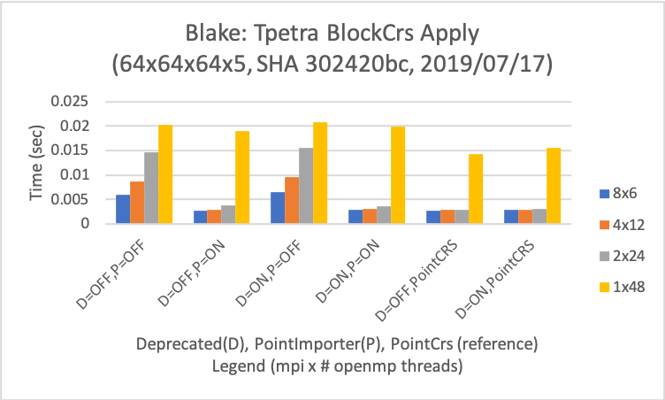
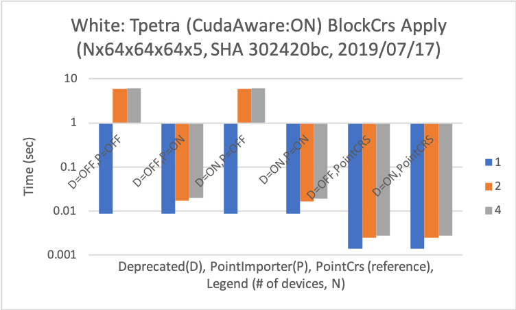

# BlockCrs Performance Test

This includes Tpetra::BlockCrs performance tests including
 * Trilinos configurations for different types of architectures e.g., Intel and NVIDIA
 * MPI/OpenMP/Cuda setup
 * Weak scale results on Sandia testbed machines upto 16 nodes.
For a comparison purpose, two plots are included to explain the difference
between major changes.

## Building Performance Test

### Trilinos Configurations

Run the configure script (we call``run-conf-tpetra.sh`` afterwards) after
setting ``USE_OPENMP``, ``USE_CUDA``, and ``ARCH_FLAG``.
```
export TRILINOS_DIR=/your/favorite/trilinos/dir
export INSTALL_DIR=/your/favorite/install/dir
export BLAS_ROOT=/your/favorite/blas/dir
export LAPACK_ROOT=/your/favorite/lapack/dir

cmake \
  -D CMAKE_BUILD_TYPE:STRING=RELEASE \
  -D CMAKE_CXX_COMPILER:FILEPATH="mpicxx" \
  -D CMAKE_CXX_FLAGS:STRING="${EXTRA_CXX_FLAGS}" \
  -D CMAKE_INSTALL_PREFIX:PATH=${INSTALL_DIR} \
  -D Trilinos_ENABLE_EXPLICIT_INSTANTIATION:BOOL=ON \
  -D Trilinos_ENABLE_TESTS:BOOL=ON \
  -D Trilinos_ENABLE_ALL_PACKAGES:BOOL=OFF \
  -D Trilinos_ENABLE_ALL_OPTIONAL_PACKAGES:BOOL=OFF \
  -D Trilinos_ENABLE_Tpetra:BOOL=ON \
  -D Kokkos_ENABLE_CXX11_DISPATCH_LAMBDA:BOOL=ON \  
  -D Kokkos_ENABLE_OPENMP:BOOL=${USE_OPENMP} \
  -D Kokkos_ENABLE_CUDA_UVM:BOOL=${USE_CUDA} \
  -D Kokkos_ENABLE_CUDA_LAMBDA:BOOL=${USE_CUDA} \
  -D KOKKOS_ARCH=${ARCH_FLAG} \
  -D TPL_ENABLE_MPI:BOOL=ON \
  -D TPL_ENABLE_BLAS:BOOL=ON \
  -D TPL_BLAS_LIBRARIES:FILEPATH="-L${BLAS_ROOT}/lib -lblas -lgfortran" \
  -D TPL_ENABLE_LAPACK:BOOL=ON \
  -D TPL_LAPACK_LIBRARIES:FILEPATH="-L${LAPACK_ROOT}/lib -llapack" \
  -D TPL_ENABLE_Boost:BOOL=ON \
  -D TPL_ENABLE_CUDA:BOOL=${USE_CUDA} \
  -D TPL_ENABLE_CUSPARSE:BOOL=${USE_CUDA} \
  ${TRILINOS_DIR} 
```

For some testbed machines, we use the following variables:
```
# SNL blake, Intel Xeon Skylake 2x24 machine 
USE_OPENMP=ON USE_CUDA=OFF ARCH_FLAG="SKX"

# SNL white, IBM Power8 and P100
USE_OPENMP=ON USE_CUDA=ON ARCH_FLAG="Power8;Pascal60"

# LLNL lassen, Power9 and V100
USE_OPENMP=ON USE_CUDA=ON ARCH_FLAG="Power9;Volta70"

# For CUDA, we need to export the following variables
export OMPI_CXX=${TRILINOS_DIR}/packages/kokkos/bin/nvcc_wrapper
export CUDA_LAUNCH_BLOCKING=1
export CUDA_MANAGED_FORCE_DEVICE_ALLOC=1
```

### Building Tpetra and Tests

1. Create a separate buld directory and ``cd build``.
2. Run the configure script ``. ../run-conf-tpetra.sh`` accordingly.
3. Make using ``make -j32``. 

## Running Performance BlockCrs Performance Tests

BlockCrs performance test uses a simple 3D cube domain with a given
blocksize e.g., 3,5,9,10. In general, we use a 64x64x64 domain size
per MPI node, which results 1.3M unknowns when a blocksize is 5.
Many thanks to James Elliot enlightening the best MPI configurations.

### Blake

A single node test with a varying the number of threads upto 48.
```
## Intel Skylake 2x24 
## Processor map to a socket (2)
for i in 6 12 24; do
  export OMP_NUM_THREADS=$i
  export ppr=$((24/${OMP_NUM_THREADS})) 
  export pi=$ppr
  export pj=2
  mpirun --map-by ppr:${ppr}:socket:pe=${OMP_NUM_THREADS} --bind-to core --report-bindings \
    ./TpetraCore_BlockCrsPerfTest.exe \
      --num-elements-i=64 --num-elements-j=64 --num-elements-k=64 \
      --num-procs-i=$pi --num-procs-j=$pj --num-procs-k=1 \
      --blocksize=5 
done
## Processor map to a node
export OMP_NUM_THREADS=48
mpirun --map-by ppr:1:node:pe=${OMP_NUM_THREADS} --bind-to core --report-bindings \
  ./TpetraCore_BlockCrsPerf.exe \
    --num-elements-i=64 --num-elements-j=64 --num-elements-k=64 \
    --num-procs-i=1 --num-procs-j=1 --num-procs-k=1 \
    --blocksize=5 
```




### White

A single node test with a varying P100 devices 1, 2, and 4.
```
## NVIDIA 4 P100 per node 
## Processor map to a node
export n=1 # 1, 2 and 4
export ni=64*$n
export pi=$n

# for n=2, we use --map-by ppr:1:socket
# for n=4, we use --map-by ppr:2:socket
mpirun --map-by ppr:1:node --bind-to core --report-bindings \
  ./TpetraCore_BlockCrsPerf.exe \
    --num-elements-i=$ni --num-elements-j=64 --num-elements-k=64 \
    --num-procs-i=$pi --num-procs-j=1 --num-procs-k=1 \
    --blocksize=5 --repeat=10 --kokkos-ndevices=$n 
```




